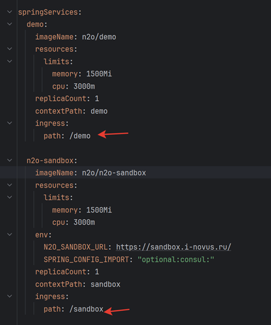
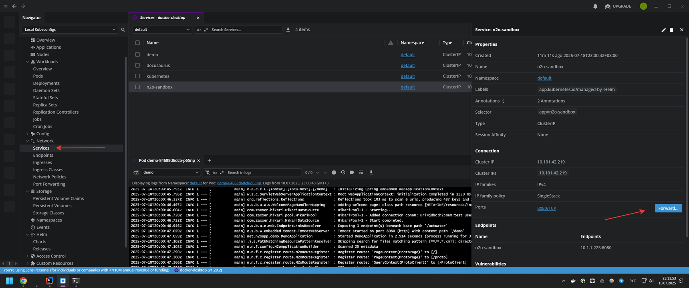

Локальное развертывание кластера kubernetes
---

## Установить:
- Docker Desktop + включить kubernetes
- Helm Chart
- Lens

### Доступ к развёрнутым сервисам
#### 1) Через Ingress

```shell
helm repo add ingress-nginx https://kubernetes.github.io/ingress-nginx
helm upgrade --install nginx ingress-nginx --repo https://kubernetes.github.io/ingress-nginx --namespace nginx --create-namespace
```
В `Lens -> Network -> Services` убедиться, что у `ingress-nginx-controller` выставлен `External IP(по умолчанию localhost)` 
и в `hosts` прописано `127.0.0.1 n2o.local.kubernetes`.

Сервисы будут доступны по https://n2o.local.kubernetes/${ingress.path}



#### 2) Через port forwarding

В `Lens -> Network -> Services` выбрать нужный сервис. Нажать кнопку Forward, выбрать порт.


### Развертывание

Настройка: [.k8s/values.local.yaml](../.k8s/values.local.yaml) - указать требуемые настройки.

Для подключения к стенду https://sandbox.i-novus.ru/ нужно указать настройку `SPRING_CLOUD_CONSUL_HOST`.

### Старт сервисов:
```shell
# Windows
local-start.bat
```
Дождаться пока соберется проект, нажать Enter, чтобы продолжить выполнение скрипта.

Если после сборки проекта изменения вносились только в файлы values.*.yaml, [docker-compose.build.yml](../.docker-compose/docker-compose.build.yml), то достаточно выполнить mvn initialize и запустить [local-helm.bat](helm/local-helm.bat).

### Остановка сервисов:
```shell
# Windows
local-stop.bat
```

