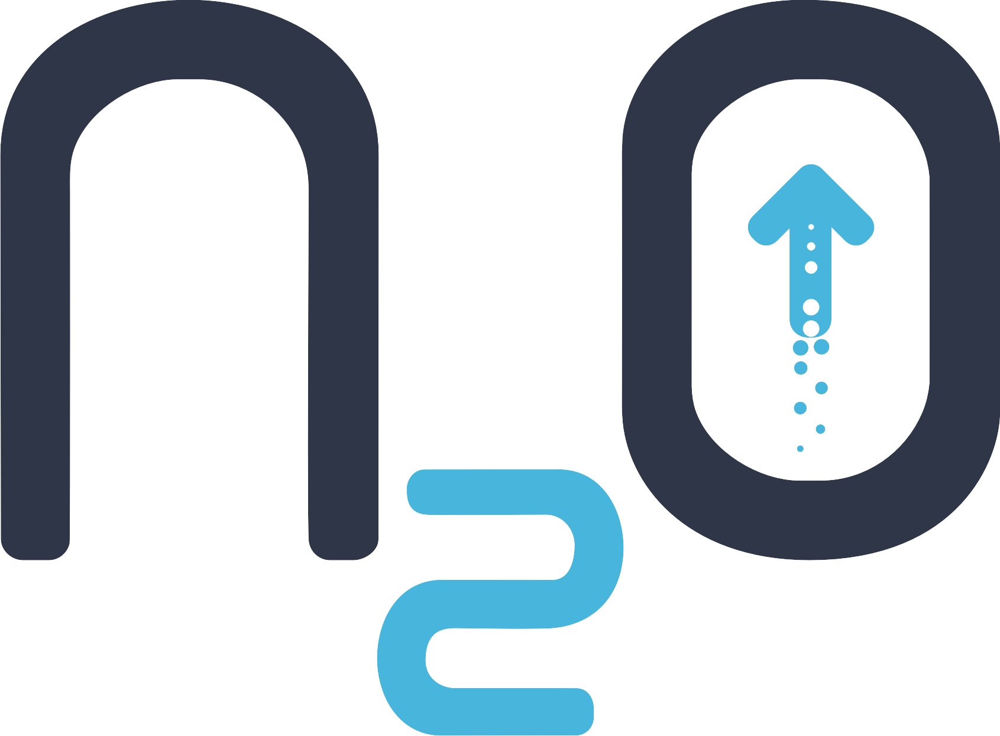

  

[N2O Framework](https://n2oapp.net) - это библиотека, написанная на Java и ReactJS, позволяющая создавать web приложения со сложными пользовательскими интерфейсами без глубоких знаний web технологий и frontend фреймворков.

[Sandbox](https://n2oapp.net/sandbox/)  |     [Демо](https://n2oapp.net/demo/)  |     [Документация](https://n2oapp.net/docs/) 
