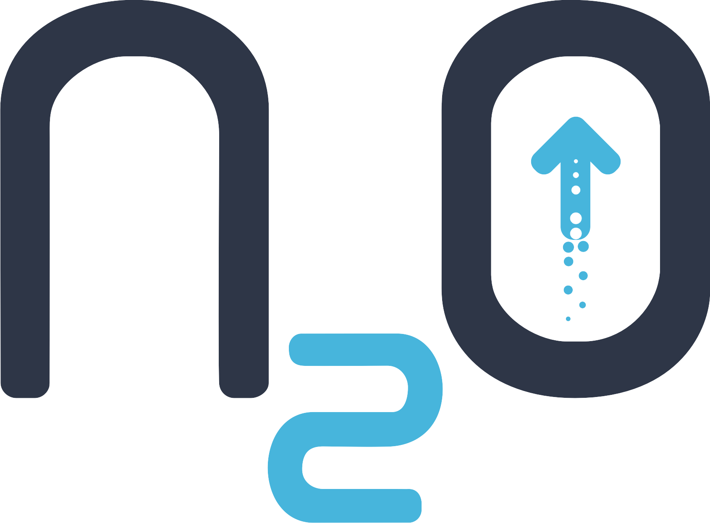

<p>
  <a href="https://n2o.i-novus.ru/" target="_blank">
    
  </a>
</p>

[](http://www.apache.org/licenses/LICENSE-2.0)

[N2O Framework](https://n2o.i-novus.ru) - это библиотека, написанная на Java и ReactJS, позволяющая создавать web приложения со сложными пользовательскими интерфейсами без глубоких знаний web технологий и frontend фреймворков.

[Песочница](https://sandbox.i-novus.ru/) <span> | </span> [Документация](https://n2o.i-novus.ru/docs/)

## Сборка проекта

Требования:
- JDK 21
- Node.js 20.x или 22.x, Yarn 3.6.4 (для frontend)

Backend:
```
./mvnw clean install
```

Frontend (из каталога `frontend/`):
```
yarn install
yarn build
```
