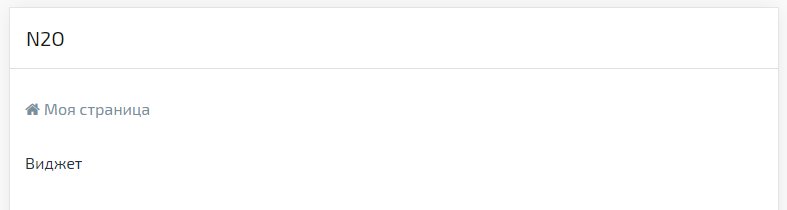
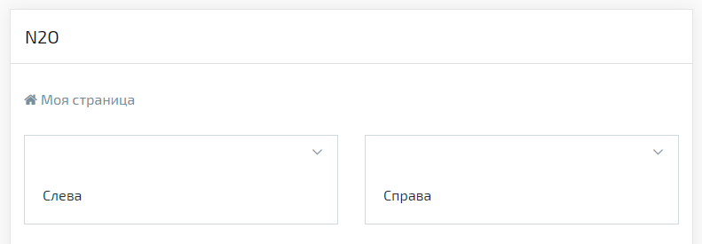
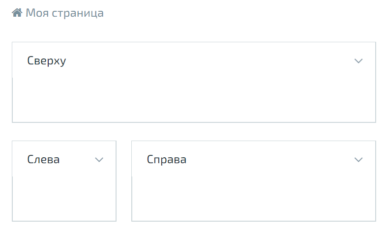
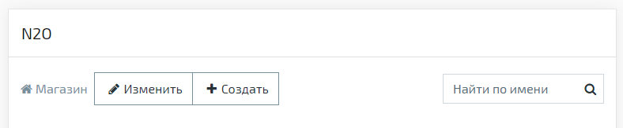
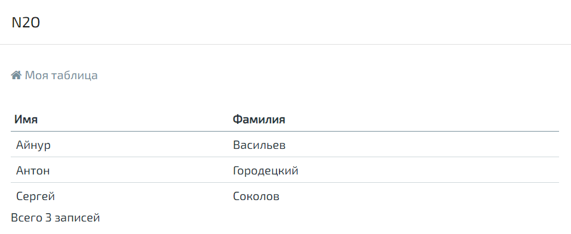
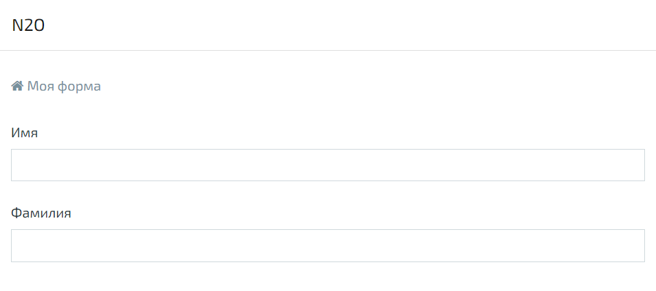
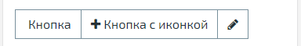
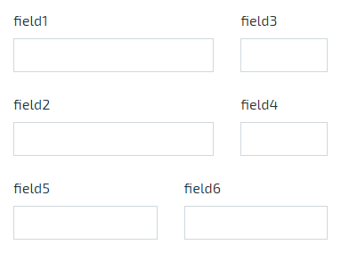
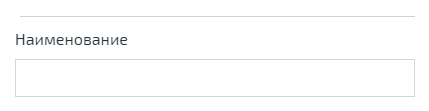

== Визуальные компоненты
N2O - компонентно-ориентированный фреймворк.
Визуальные компоненты разработаны на React.
Компоненты имеют иерархическую структуру.

image::images\components.png[]

=== Страница

Приложения на N2O состоят из страниц.
Страницы задаются в файлах вида `*.page.xml`.
Страницы могут иметь простую или сложную разметку.

Простая страница содержит один единственный компонент-виджет,
занимающий всё свободное пространство.

.Простая страница
[source,xml]
----
<simple-page xmlns="http://n2oapp.net/framework/config/schema/page-3.0"
  name="Моя страница">
  <form>...</form><!-- Виджет -->
</simple-page>
----

Сложные страницы поделены на регионы,
которые могут располагаться в разных областях страницы.

image::images/page_standard.png[]

.Стандартная страница
[source,xml]
----
<?xml version='1.0' encoding='UTF-8'?>
<page xmlns="http://n2oapp.net/framework/config/schema/page-3.0"
  name="Моя страница">
  <regions>
    <!-- Регионы -->
  </regions>
</page>
----

.Страница с разметкой регионов "слева и справа"
[source,xml]
----
<?xml version='1.0' encoding='UTF-8'?>
<left-right-page xmlns="http://n2oapp.net/framework/config/schema/page-3.0"
      name="Моя страница">
  <left>
    <panel>...</panel>
  </left>
  <right>
    <panel>...</panel>
  </right>
</page>
----

.Страница с разметкой регионов "сверху, слева и справа"
[source,xml]
----
<?xml version='1.0' encoding='UTF-8'?>
<top-left-right-page xmlns="http://n2oapp.net/framework/config/schema/page-3.0"
      name="Моя страница">
  <top>
    <panel>...</panel>
  </top>
  <left width="30%">
    <panel>...</panel>
  </left>
  <right width="70%">
    <panel>...</panel>
  </right>
</page>
----

.Страница с поисковой строкой
[source,xml]
----
<?xml version='1.0' encoding='UTF-8'?>
<searchable-page xmlns="http://n2oapp.net/framework/config/schema/page-3.0"
      name="Моя страница">
  <search-bar search-filter-id="name" search-param="name"/>
  <regions>
    <!-- Регионы -->
  </regions>
</searchable-page>
----

.Виды страниц
[cols="1,1,2"]
|===
|Вид|React компонент|Описание

|<simple-page>
|SimplePage
|link:https://n2oapp.net/sandbox/editor/manual_page_simple/[Страница с единственным виджетом]

|<page>
|StandardPage
|link:https://n2oapp.net/sandbox/editor/manual_page_standard/[Страница с регионами]

|<left-right-page>
|LeftRightPage
|link:https://n2oapp.net/sandbox/editor/manual_page_left_right/[Страница с разметкой регионов "слева и справа"]

|<top-left-right-page>
|TopLeftRightPage
|link:https://n2oapp.net/sandbox/editor/manual_page_top_left_right/[Страница с разметкой регионов "сверху, слева и справа"]

|<searchable-page>
|SearchablePage
|link:https://n2oapp.net/sandbox/editor/manual_page_searchable/[Страница с поисковой строкой]

|===

=== Регион

В регион могут вкладываться произвольное количество виджетов и регионов.
Регионы имеют свою верстку для различной компоновки виджетов.

image::images/tabs.png[]

.Регион в виде вкладок
[source,xml]
----
<regions>
  <tabs>
    <!-- Вкладки -->
    <tab name="Один">...</tab>
    <tab name="Два">...</tab>
    ...
  </tabs>
</regions>
----

.Виды регионов
[cols="1,1,2"]
|===
|Вид|React компонент|Описание

|<region>
|NoneRegion
|link:https://n2oapp.net/sandbox/editor/manual_regions_region/[Виджеты без обрамления]

|<tabs>
|TabsRegion
|link:https://n2oapp.net/sandbox/editor/manual_regions_tabs/[Виджеты во вкладках]

|<panel>
|PanelRegion
|link:https://n2oapp.net/sandbox/editor/manual_regions_panel/[Виджеты в панелях]

|<line>
|ListRegion
|link:https://n2oapp.net/sandbox/editor/manual_regions_line/[Горизонтальная черта над виджетом]

|===

=== Виджет
Виджеты отображают и управляют данными одного объекта.
Виджеты задаются в файлах вида `*.widget.xml`:

.Виджет в отдельном файле
[source,xml]
----
<?xml version='1.0' encoding='UTF-8'?>
<table xmlns="http://n2oapp.net/framework/config/schema/widget-4.0"
       name="Моя таблица">
    ...
</table>
----

Можно вкладывать виджеты в страницу:

.Виджет внутри страницы
[source,xml]
----
<?xml version='1.0' encoding='UTF-8'?>
<simple-page xmlns="http://n2oapp.net/framework/config/schema/page-3.0">
  <table name="Моя таблица">
      ...
  </table>
</simple-page>
----

Или в регион:

.Виджет внутри региона
[source,xml]
----
<?xml version='1.0' encoding='UTF-8'?>
<page xmlns="http://n2oapp.net/framework/config/schema/page-3.0">
  <regions>
    <table name="Моя таблица">
          ...
    </table>
  </regions>
</page>
----

.Виды основных виджетов
[cols="1,1,2"]
|===
|Вид|React компонент|Описание

|<form>
|FormWidget
|link:https://n2oapp.net/sandbox/editor/manual_widget_form/[Форма]

|<table>
|TableWidget
|link:https://n2oapp.net/sandbox/editor/manual_widget_table/[Таблица]

|<list>
|ListWidget
|link:https://n2oapp.net/sandbox/editor/manual_widget_list/[Список]

|<tree>
|TreeWidget
|link:https://n2oapp.net/sandbox/editor/manual_widget_tree/[Дерево]

|===

Описание других виджетов можно посмотреть link:../xml/#_Виджеты[здесь].

==== Таблица

Таблица - виджет N2O, представляющий данные в виде таблицы
с возможностью сортировки, фильтрации, паджинации.

.Виджет таблица
[source,xml]
----
<?xml version='1.0' encoding='UTF-8'?>
<table xmlns="http://n2oapp.net/framework/config/schema/widget-4.0"
  name="Моя таблица"
  query-id="table">
  <columns>
    <column text-field-id="firstName" label="Имя"/>
    <column text-field-id="lastName" label="Фамилия"/>
  </columns>
</table>
----
Столбцы таблицы задаются внутри элемента `<columns>`.

==== Форма

Форма - виджет N2O, представляющий одну запись данных
в виде полей с возможностью просмотра или редактирования.

.Виджет форма
[source,xml]
----
<?xml version='1.0' encoding='UTF-8'?>
<form xmlns="http://n2oapp.net/framework/config/schema/widget-4.0"
  name="Моя форма">
  <fields>
    <input-text id="firstName" label="Имя"/>
    <input-text id="lastName" label="Фамилия"/>
  </fields>
</form>
----
Поля формы задаются внутри элемента `<fields>`.

==== Автоматическое сохранение данных формы

В N2O есть возможность автоматически сохранять данные формы без необходимости
нажатия кнопки. Для этого используется действие формы `<submit>`.

.Автоматическое сохранение формы
[source,xml]
----
<?xml version='1.0' encoding='UTF-8'?>
<form xmlns="http://n2oapp.net/framework/config/schema/widget-4.0"
      name="Моя форма">
  <fields>
    <input-text id="firstName" label="Имя"/>
    <input-text id="lastName" label="Фамилия"/>
  </fields>
  <submit operation-id="update"/>
</form>
----

=== Кнопки и действия

В N2O можно вызывать различные действия над виджетами:
открытие страниц, ссылок, выполнение запросов на сервер и т.п.

==== Панель кнопок
Кнопки задаются в теле виджета внутри панели инструментов `<toolbar>`:

.Кнопки виджета
[source,xml]
----
<table>
  <toolbar>
    <button>...</button>
    <button>...</button>
    ...
  </toolbar>
</table>
----

Элемент `<toolbar>` так же можно задать на странице:

.Кнопки страницы
[source,xml]
----
<page>
    <toolbar>
      <button>...</button>
      <button>...</button>
      ...
    </toolbar>
</page>
----
В этом случае в кнопках необходимо уточнить над каким виджетом они выполняют действия:

.Виджет над которым произойдет действие кнопки
[source,xml]
----
<page>
  <toolbar>
    <button widget-id="main">...</button>
  </toolbar>
</page>
----

Можно задать местоположение панели кнопок через атрибут `place`:

.Позиция кнопок
[source,xml]
----
<toolbar place="topLeft">
  ...
</toolbar>
<toolbar place="bottomRight">
  ...
</toolbar>
----
[NOTE]
Местоположение панели кнопок зависит от реализации React компонента страницы и виджета.

Кнопки можно соединять в группы:

.Группа кнопок
[source,xml]
----
<toolbar>
  <group>
    <button>...</button>
    <button>...</button>
    ...
  </group>
  <group>
    ...
  </group>
</toolbar>
----

==== Кнопка
Кнопка - это визуальный элемент, на который можно нажать для выполнения действия.
Кнопка может иметь разный размер, цвет, верстку:

.Иконка кнопки

[source,xml]
----
<button label="Кнопка"/>
<button label="Кнопка  с иконкой" icon="fa fa-plus"/>
<button label="Иконка" icon="fa fa-pencil" type="icon"/>
----

image::images/button-color.png[]

.Цвет кнопки

[source,xml]
----
<button label="Главная" color="primary"/>
<button label="Опасная" color="danger"/>
<button label="Ссылка" color="link"/>
----

image::images/button-submenu.png[]

.Кнопка с выпадающим списком
[source,xml]
----
<sub-menu label="Меню">
  <menu-item label="Один">...</menu-item>
  <menu-item label="Два">...</menu-item>
</sub-menu>
----

Кнопка является React компонентом и имеет несколько реализаций:

.Виды кнопок
[cols="1,1,2"]
|===
|Вид|React компонент|Описание

|<button>
|PerformButton
|link:https://n2oapp.net/sandbox/editor/manual_action_button/[Кнопка с действием]

|<link>
|LinkButton
|Кнопка-ссылка на другую страницу

|<sub-menu>
|DropdownButton
|link:https://n2oapp.net/sandbox/editor/manual_action_submenu/[Кнопка с вложенным меню]

|===

==== Действие кнопки
Кнопки вида `<button>` при нажатии выполняют определенное действие над виджетом.
Большинство действий выполняется с помощью библиотеки link:https://redux.js.org/[Redux].
Действия Redux меняют состояние React компонентов и отправляют запросы на сервер.

.Виды действий
[cols="1,2,2"]
|===
|Вид|Redux действие|Описание

|<invoke>
|n2o/actionImpl/START_INVOKE
|link:https://n2oapp.net/sandbox/editor/manual_action_invoke/[Отправка данных формы]

|<show-modal>
|n2o/modals/INSERT
|link:https://n2oapp.net/sandbox/editor/manual_action_show_modal/[Открытие модального окна]

|<open-page>
|
|link:https://n2oapp.net/sandbox/editor/manual_action_open_page/[Открытие вложенной страницы]

|<close>
|n2o/modals/CLOSE
|link:https://n2oapp.net/sandbox/editor/manual_action_close/[Закрытие модального окна или возврат на предыдущую страницу]

|<refresh>
|n2o/widgets/DATA_REQUEST
|Обновление данных виджета

|<clear>
|n2o/widgets/DATA_REQUEST
|link:https://n2oapp.net/sandbox/editor/manual_action_clear/[Очистка данных виджета]

|<copy>
|n2o/widgets/DATA_REQUEST
|link:https://n2oapp.net/sandbox/editor/manual_action_copy/[Копирование данных виджета из одной модели в другую]

|<print>
|n2o/toolbar/PRINT_BUTTON
|Печать документа

|===

Действие можно задать внутри кнопки:

.Действие внутри кнопки
[source,xml]
----
<button label="Изменить">
  <invoke operation-id="update"/>
</button>
----

Либо в элементе `<actions>` в теле виджета:

.Действие, заданное отдельно от кнопок
[source,xml]
----
<table>
  <actions>
    <action id="create" label="Создать">
      <show-modal
        page-id="myForm"
        submit-operation-id="create"/>
    </action>
  </actions>
</table>
----

На одно и тоже действие виджета можно ссылаться из различных мест,
которые могут выполнять действия, например, из кнопок:

.Ссылка на действие в кнопке
[source,xml]
----
<button action-id="create"/>
----

=== Филдсеты
Филдсеты группируют link:#_Поля_ввода[поля]
и другие филдсеты со своей вёрсткой и логикой.
Филдсеты задаются в файлах вида `*.fieldset.xml`.

.Филдсет отдельным файлом
[source,xml]
----
<?xml version='1.0' encoding='UTF-8'?>
<set xmlns="http://n2oapp.net/framework/config/schema/fieldset-4.0">
  ...
</set>
----

Либо можно задать филдсет внутри формы:

.Филдсет внутри формы
[source,xml]
----
<form>
  <fields>
    <set>
      ...
    </set>
  </fields>
</form>
----

.Виды филдсетов
[cols="1,1,2"]
|===
|Вид|React компонент|Описание

|<set>
|StandardFieldset
|link:https://n2oapp.net/sandbox/editor/manual_fieldset_set/[Филдсет без верстки]

|<line>
|LineFieldset
|link:https://n2oapp.net/sandbox/editor/manual_fieldset_line/[Филдсет с горизонтальной чертой]

|===

В филдсете поля можно расположить в строку или столбец
с помощью элементов `<row>` и `<col>`.

.Расположение полей в строку или столбец
[source,xml]
----
<fields>
  <set>
    <row>
      <!-- Первая строка с двумя столбцами -->
      <col size="8">
        ... <!-- Поля первого столбца -->
      </col>
      <col size="4">
        ... <!-- Поля второго столбца -->
      </col>
    </row>
    <row>
      ... <!-- Вторая строка -->
    </row>
  </set>
</fields>
----

Ширина столбца `<col>` задается атрибутом `size`.
Всего доступно 12 размеров согласно сетке link:https://getbootstrap.com/docs/4.0/layout/grid/[Bootstrap].

.Мульти-филдсеты
Существует возможность создавать филдсеты с динамическим числом полей.
При нажатии кнопки добавления в филдсет будет добавлено еще одно поле или набор полей.
Также имеется возможность удаления полей и копирования.

С помощью `{index}` можно управлять нумерацией заголовков дочерних элементов
(Например: "Участник 1", "Участник 2" и т.д.). По умолчанию нумерация с нуля.
Для задания нумерации с единицы воспользуйтесь выражением `{(index + 1)}`.
[source,xml]
----
<form>
    <fields>
        <multi-set id="members" children-label="Участник {index}" add-label="Добавить участника"
                   can-remove-all="true" remove-all-label="Удалить всех участников" can-copy="true">
            ...
        </multi-set>
    </fields>
</form>
----

=== Поля ввода
Поля ввода - это простейшие компоненты N2O, предназначенные для ввода или вывода различных данных.
Поля могу содержать заголовок, подсказку, сообщения валидации и многое другое.

Поля перечисляются на форме в элементе `<fields>`:

link:https://n2oapp.net/sandbox/editor/manual_fields_form/[Поля в форме]

image::images/form.png[]
[source,xml]
----
<form>
  <fields>
    <input-text id="name" label="Наименование"/>
  </fields>
</form>
----

Либо вкладываются в филдсет:

link:https://n2oapp.net/sandbox/editor/manual_fields_fieldset/[Поля в филдсете]

[source,xml]
----
<line>
  <input-text id="name" label="Наименование"/>
</line>
----

Все поля должны иметь уникальный в рамках виджета идентификатор `id`.
По нему происходит link:#_Связывание_с_данными[связывание с данными].

.Основные виды полей
[cols="1,1,2"]
|===
|Вид|React компонент|Описание

|<input-text>
|InputText
InputNumber
|link:https://n2oapp.net/sandbox/editor/manual_fields_input_text/[Поле ввода текста или чисел]

|<output-text>
|OutputText
|link:https://n2oapp.net/sandbox/editor/manual_fields_output_text/[Поле вывода текста]

|<checkbox>
|Checkbox
|link:https://n2oapp.net/sandbox/editor/manual_fields_checkbox/[Поле чекбокса]

|<date-time>
|DatePicker
|link:https://n2oapp.net/sandbox/editor/manual_fields_date_time/[Поле ввода даты и времени]

|<select>
|Select
|link:https://n2oapp.net/sandbox/editor/manual_fields_select/[Поле выбора из выпадающего списка]

|<input-select>
|InputSelect
|link:https://n2oapp.net/sandbox/editor/manual_fields_input_select/[Поле ввода текста с выбором из выпадающего списка]

|<radio-group>
|RadioGroup
|link:https://n2oapp.net/sandbox/editor/manual_fields_radio_group/[Поле группы радио кнопок]

|<checkbox-group>
|CheckboxGroup
|link:https://n2oapp.net/sandbox/editor/manual_fields_checkbox_group/[Поле группы чекбоксов]

|<text-area>
|TextArea
|link:https://n2oapp.net/sandbox/editor/manual_fields_text_area/[Многострочное поле ввода]

|<input-select-tree>
|InputSelectTree
|link:https://n2oapp.net/sandbox/editor/manual_fields_input_select_tree/[Компонент ввода с выбором в выпадающем списке в виде дерева]

|<text>
|Text
|link:https://n2oapp.net/sandbox/editor/manual_fields_text/[Компонент текста]

|<text-editor>
|TextEditor
|link:https://n2oapp.net/sandbox/editor/manual_fields_text_editor/[Компонент редактора текста]

|<date-interval>
|DateInterval
|link:https://n2oapp.net/sandbox/editor/manual_fields_date_interval/[Компонент ввода интервала дат]

|<code-editor>
|CodeEditor
|link:https://n2oapp.net/sandbox/editor/manual_fields_code_editor/[Компонент редактора кода]

|<file-upload>
|FileUpload
|link:https://n2oapp.net/sandbox/editor/manual_fields_file_upload/[Компонент загрузки файлов]

|<slider>
|Slider
|link:https://n2oapp.net/sandbox/editor/manual_fields_slider/[Компонент ползунок]

|<time-picker>
|TimePicker
|link:https://n2oapp.net/sandbox/editor/manual_fields_time_picker/[Компонент ввода времени]
|===

Описание других видов полей можно посмотреть link:../xml/index.html#_Поля_ввода[здесь].

=== Ячейка
Ячейки - это простейшие компоненты, которые отображают информацию в записях таблицы или списка.

Ячейки встраиваются в столбцы таблицы:

image::images/cell_in_table.png[]

.Ячейка-текст в таблице
[source,xml]
----
<table>
  <columns>
    <column text-field-id="birthday">
      <text format="date DD.MM.YYYY"/>
    </column>
  </columns>
</table>
----

Или в содержимое виджета-списка:

image::images/cell_in_list.png[]

.Ячейка-текст в виджете-список
[source,xml]
----
<list>
  <content>
    <body text-field-id="birthday">
      <text format="date DD.MM.YYYY"/>
    </body>
  </content>
</list>
----

.Переключаемые ячейки
Предоставляют возможность использовать различные виды ячеек в колонке
в зависимости от условия.
[source,xml]
----
<switch value-field-id="type">
    <case value="type1">
        <badge.../>
    </case>
    <case value="type2">
        <icon.../>
    </case>
    ...
    <default>
        <text/>
    </default>
</switch>
----

.Основные виды ячеек
[cols="1,1,2"]
|===
|Элемент|React компонент|Описание

|<text>
|TextCell
|link:https://n2oapp.net/sandbox/editor/manual_cell_text/[Текстовая ячейка]

|<badge>
|BadgeCell
|link:https://n2oapp.net/sandbox/editor/manual_cell_badge/[Ячейка значок]

|<icon>
|IconCell
|link:https://n2oapp.net/sandbox/editor/manual_cell_icon/[Ячейка иконка]

|<link>
|LinkCell
|link:https://n2oapp.net/sandbox/editor/manual_cell_link/[Ячейка ссылка]

|<checkbox>
|CheckboxCell
|link:https://n2oapp.net/sandbox/editor/manual_cell_checkbox/[Ячейка чекбокс]

|<toolbar>
|ToolbarCell
|link:https://n2oapp.net/sandbox/editor/manual_cell_toolbar/[Ячейка с меню кнопок]

|===

=== Хедер
Хедер - это заголовок каждой страницы,
содержащий меню навигации, меню пользователя и другое.
Структура хедера задается в файле `*.header.xml`.
Обычно в приложении существует только один хедер.
Если их в приложении несколько, то необходимо задать идентификатор хедера в настройке `n2o.header.id`.

image::images/header.png[]

.Структура хедера
[source,xml]
----
<?xml version='1.0' encoding='UTF-8'?>
<header xmlns="http://n2oapp.net/framework/config/schema/header-2.0"
        brand-name="Мое приложение">
  <nav>
    ...
  </nav>
  <extra-menu>
    ...
  </extra-menu>
</header>
----

=== Меню навигации

Меню навигации задаётся в файлах вида `*.menu.xml`:

.Меню навигации в отдельном файле
[source,xml]
----
<?xml version='1.0' encoding='UTF-8'?>
<nav xmlns="http://n2oapp.net/framework/config/schema/menu-2.0">
  <page page-id="menu1" label="Первая страница"/>
  <page page-id="menu2" label="Вторая страница"/>
  ...
</nav>
----

Либо перечисляется внутри элементов `<nav>` и `<extra-menu>` хедера:

.Меню навигации в хедере
[source,xml]
----
<?xml version='1.0' encoding='UTF-8'?>
<header xmlns="http://n2oapp.net/framework/config/schema/header-2.0"
        brand-name="Мое приложение">
    <nav>
      <page page-id="menu1" label="Первая страница"/>
      <page page-id="menu2" label="Вторая страница"/>
    </nav>
</header>
----

На меню навигации, заданному в отдельном файле, можно ссылаться
через атрибут `ref-id` в элементах `<nav>` и `<extra-menu>` хедера:

.Ссылка на меню навигации
[source,xml]
----
<?xml version='1.0' encoding='UTF-8'?>
<header xmlns="http://n2oapp.net/framework/config/schema/header-2.0">
    <nav ref-id="myMenu"/>
</header>
----

.Виды меню навигации
[cols="1,3"]
|===
|Вид|Описание

|<page>
|Ссылка на страницу N2O

|<a>
|Ссылка на произвольную страницу

|<sub-menu>
|Вложенное меню

|===
