# Сборка и развертывание проектов

## Запуск frontend N2O-стенда
1. Перейти в директорию `~/frontend`
2. Установить зависимости (эта команда выполняется, если у вас их нет):    
   `yarn install`
3. Открыть файл `~/frontend/demo/src/setupProxy.js` и подставить нужный URL в свойство `target`:
>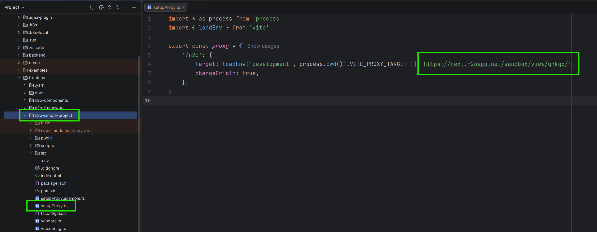
4. Установить необходимые библиотеки для корректного выполнения приложения:       
   `yarn run build:libs`
5. Компиляция исходников:
   - Если вам необходимо следить за изменениями в коде и быстро перекомпилироваться, то используйте (запуск http сервера запускается отдельно):   
     `yarn run compile:watch`
   - Если хотите скомпилировать production версию, то используйте:  
     `yarn run build:n2o`
6. Для запуска frontend выполнить:  
   `yarn start:demo`
   
## Запуск frontend N2O-demo

Чтобы запустить frontend N2O-demo, выполните шаги из [Запуск frontend N2O-стенда](#randomstand), используя URL на стенд которого нужно проксироваться, например:
>  https://n2oapp.net/demo/

## Запуск frontend N2O-sandbox

Чтобы запустить frontend N2O-sandbox, выполните шаги из [Запуск frontend N2O-стенда](#randomstand), используя URL на стенд которого нужно проксироваться, например:  
> https://n2oapp.net/sandbox/view/PtQCs/

>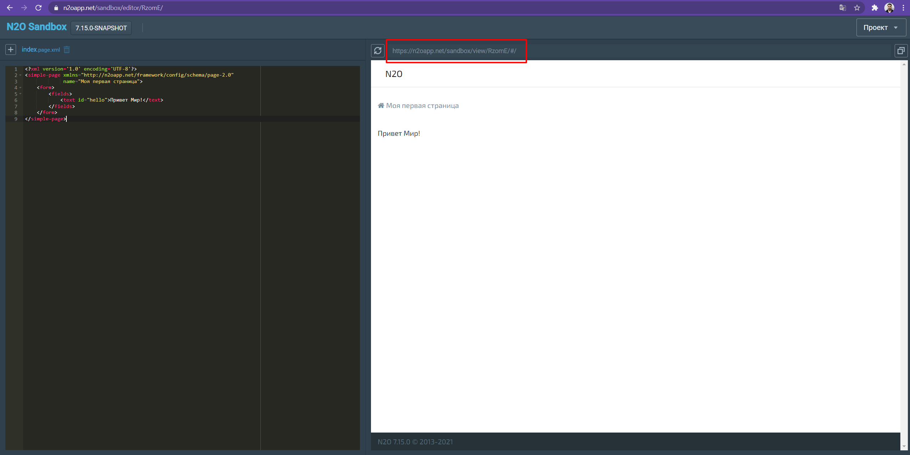

## Запуск frontend прикладного проекта:

Чтобы запустить frontend прикладного проекта, выполните шаги из [Запуск frontend N2O-стенда](#randomstand), используя URL на стенд которого должны проксироваться, например:
>example.ru

И дополнительно настроить cookie авторизации:

1. Авторизоваться по адресу прикладного проекта
2. Найти cookie с именем `JSESSIONID`, копировать её название и значение
3. Добавить cookie на localhost после запуска приложения

## В случае неудачи запуска frontend N2O-стенда
Выполните следующие шаги:
1. Перейти в директорию `~/frontend`
2. Удалить зависимости из дочерних директорий:  
   `yarn run clean`
3. Удалить директорию __node_modules__
4. Начните запуск заново [Запуск frontend N2O-стенда](#randomstand)

## Запуск JS юнит-тестов
Чтобы запустить js unit-тесты, выполните только 1 и 2 шаги из [Запуск frontend N2O-стенда](#randomstand) и, дополнительно:

   1. Перейти в директорию `~/frontend/n2o-framework`
   2. Запустить unit-тестов:  
      `yarn test:jest`
      

## Настройка окружения для java-тестов и их запуск (selenide)

### Настройка тестового окружения

1. Установить IntelliJ IDEA Community
2. Установить jdk (версия jdk должна быть ниже _15.0.0_, в моём случае — _14.0.1_) 
3. Подключить jdk к IntelliJ IDEA:
   
   >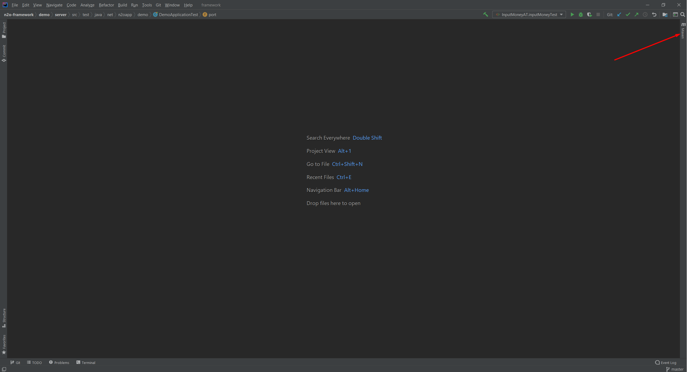
   >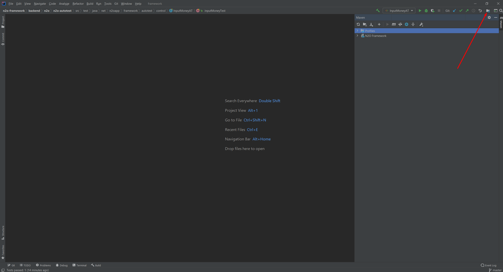
   >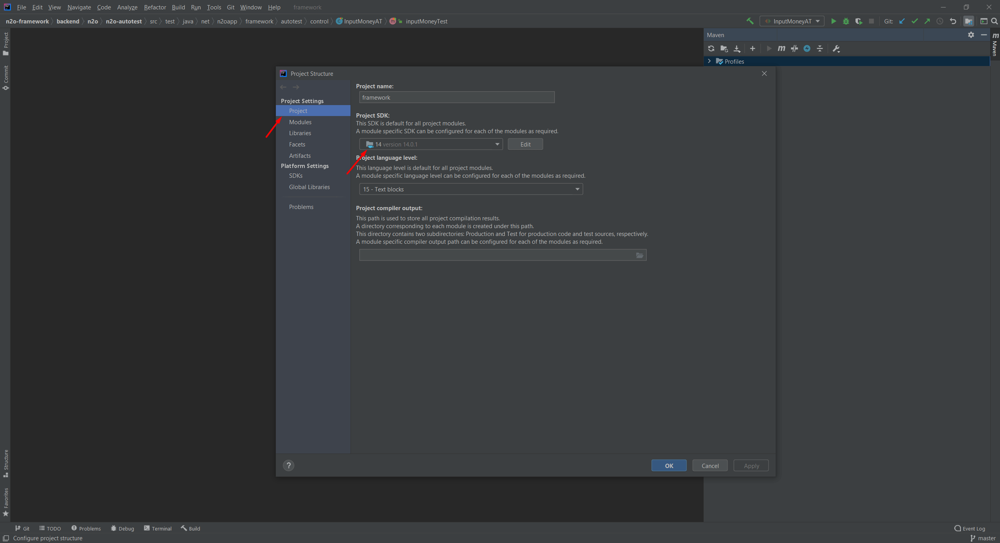
4. Установить все зависимости:
   
   >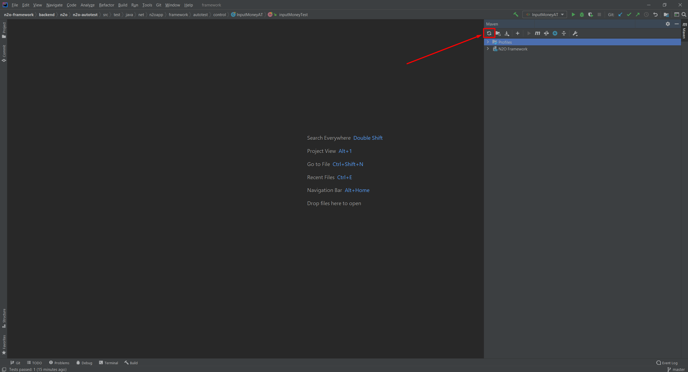

### Запуск тестов

Если вам понадобилось провести авто-тесты, то выполните следующие действия:

#### Запуск всех тестов
1. Во вкладке maven открыть `Maven goals`:
   >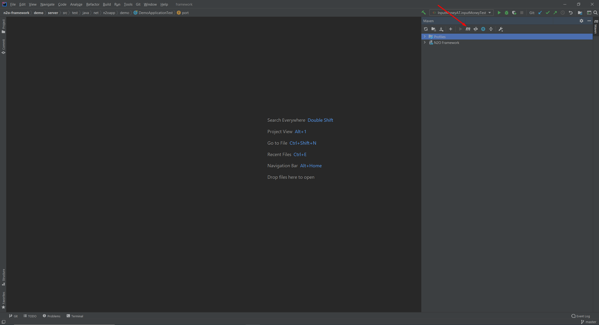
2. В открывшемся модальном окне ввести `mvn clean install`
   >
3. И начать проверку `mvn verify`
   >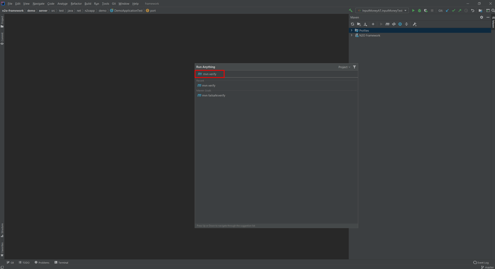

#### Запуск отдельного теста
1. Найти искомый тест в проекте
2. Запустить тест, нажав Run 'testName' (кнопка рядом с номером строки теста):
   
   >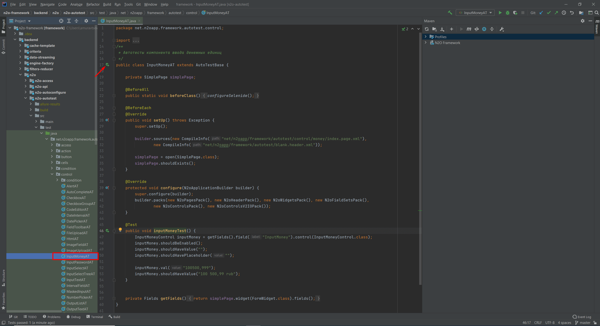

***
Тесты можно запустить с визуализацией и без (headless-режим), для этого выполните следующие действия:
   1. Найдите класс `AutoTestBase`
   2. Установите значение для свойства `selenide.headless`:
      - `"false"` для запуска с визуализацией
      - `"true"` для запуска без визуализации
   
>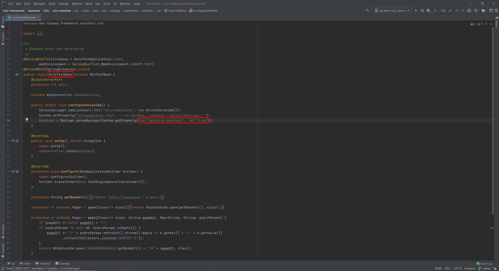
   
>Не рекомендуется запускать все тесты сразу с визуализацией 

## Запуск backend N2O-demo

Для того чтобы запустить backend, выполните следующие шаги:

1. Перейти во вкладку maven:
   >
   
2. Выключить тесты, чтобы ускорить процесс запуска
   > Имейте в виду, что при выключенной кнопке вы не сможете запускать сразу все авто-тесты, но по отдельности — можно
   
   >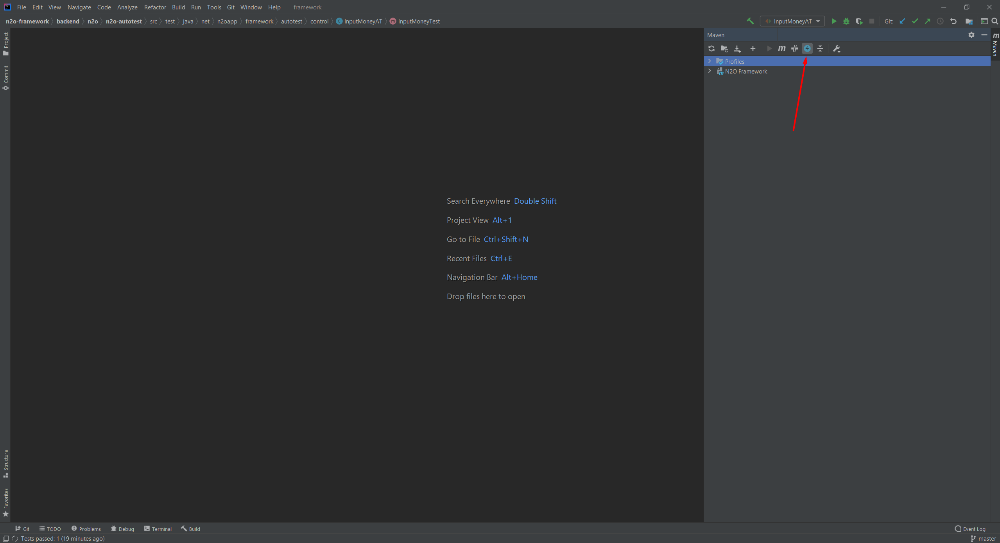

3. Во вкладке __profiles__ выбрать _backend_, _frontend_ и _frontend-build_:
   >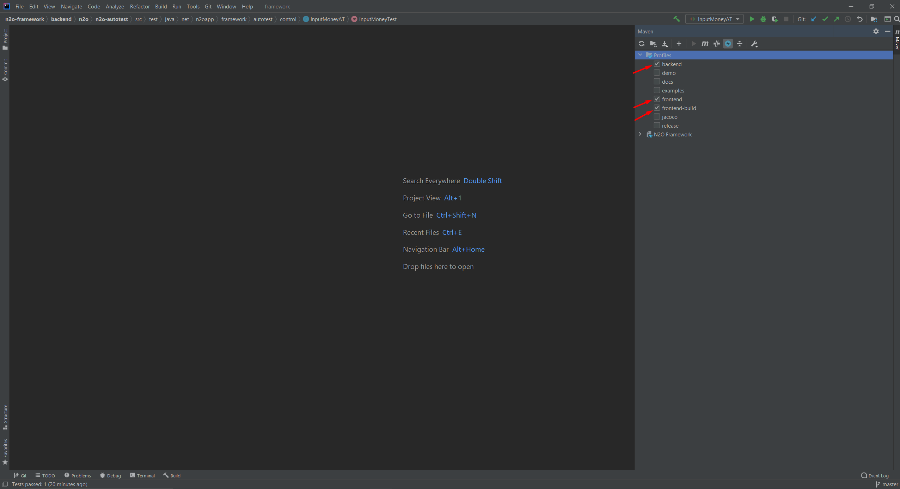
   >- backend - добавить бэкэнд код N2O в Java-артефакт
   >- frontend - добавить фронтенд-статику из папки `dist` (`n2o-frontend`) в Java-артефакт. Выключение профиля имеет смысл, если фронт не нужен, а нужны только бэкэнд сервисы
   >- frontend-build - компиляция фронтенд-статики в папку `dist` пакета n2o-frontend (профиль доступен только если включен профиль `frontend`). Отключение профиля имеет смысл, если фронт уже был собран и обновление не требуется, либо собирается в ручном режиме yarn'ом

4. Во вкладке __n2o-framework/lifecycle__ запустить _clean_, а затем _package_:
   >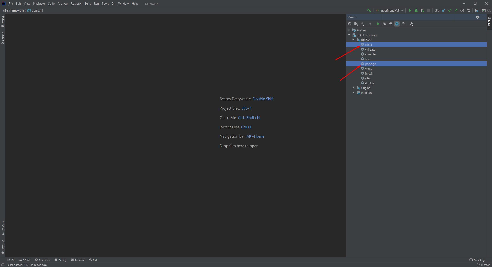

5. Запуск N2O-backend:
   
   I.
   
   Запустить `~/demo/server/src/main/java/net.n2oapp.demo/DemoApplication`:
   >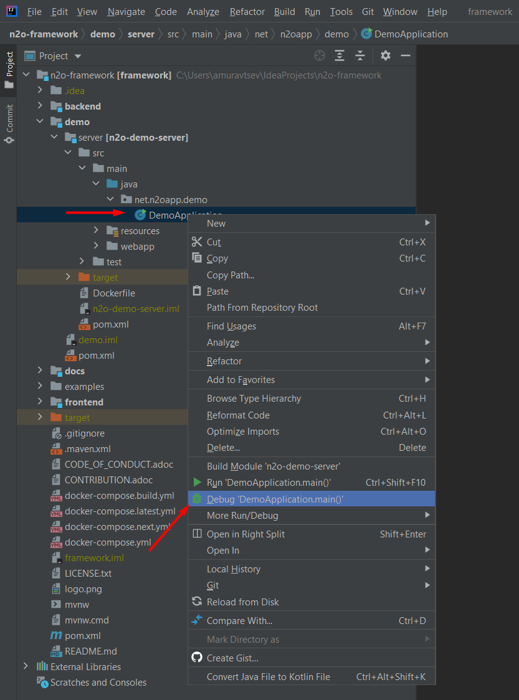

   II.
   
   Создать конфигурацию и в поле Path to JAR указать нужный jar-файл: `n2o-framework/demo/server/target/demo.jar`:
   >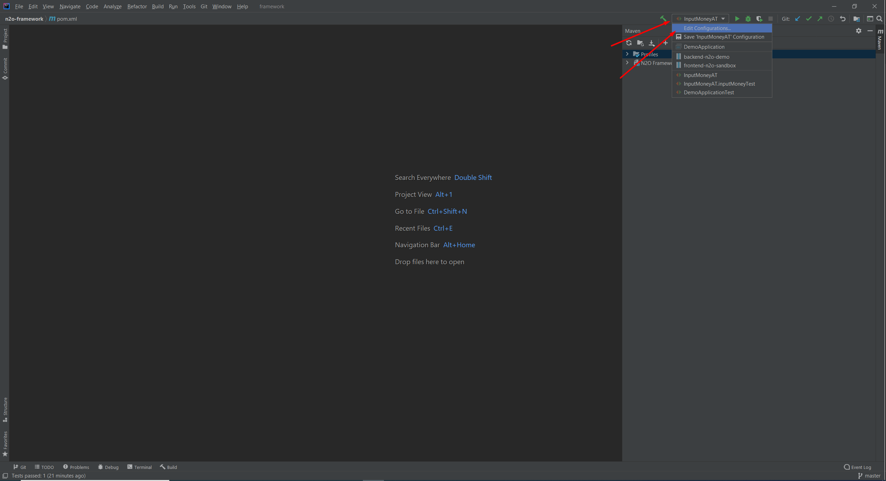
   >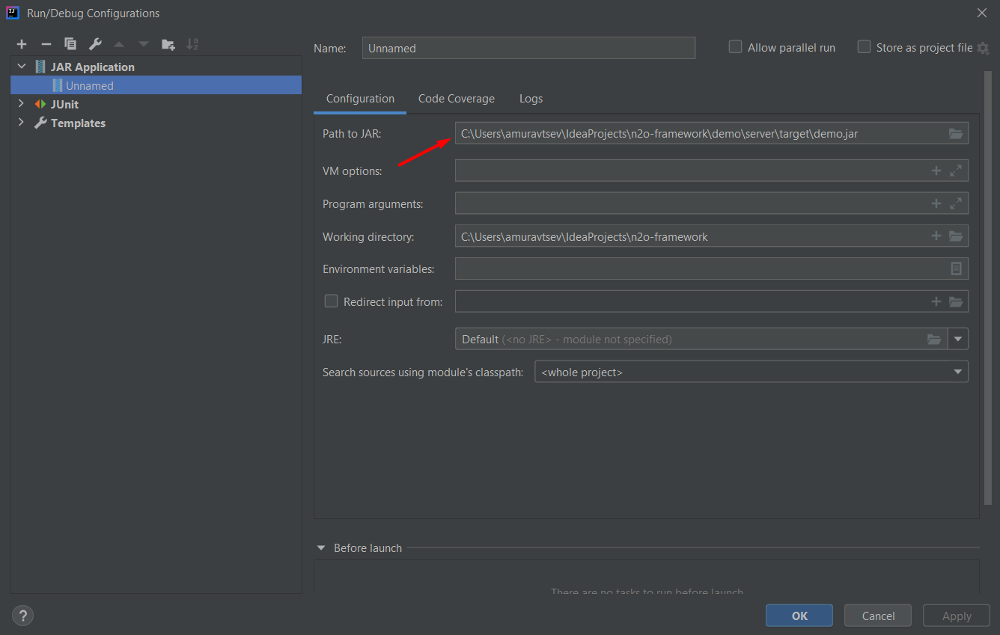
   
   Запустить конфигурацию:
   >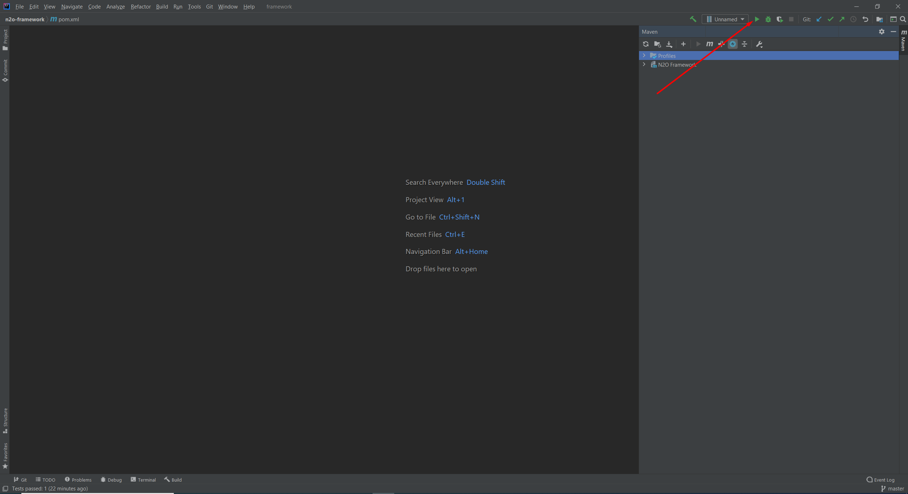
