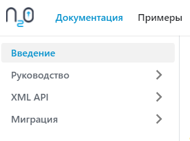
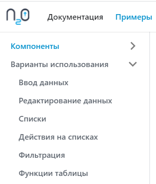
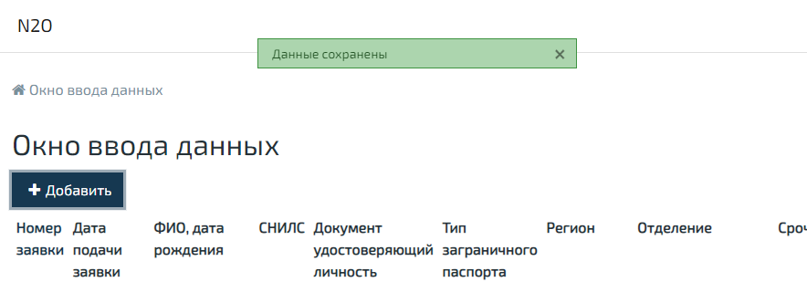

Друзья, мы выпустили N2O Framework 7.17.0.

<!--truncate-->

Этот релиз дался нам нелегко.
Мы впервые начали серьезно рефакторить фронтенд часть N2O.
Добавили очень крупное архитектурное изменение.
Переехали на новый движок документации.
Исправили кучу багов.
И, совместно с аналитиками, сделали новые примеры использования N2O.

Но главное, у нас открылся сайт-визитка https://n2oapp.net!
Пока там нет дизайна, а наполнение главной страницы чисто техническое.
Однако, уже сейчас с них удобно переходить в документацию, примеры, а в дальнейшем в блог и release notes.

Мы сменили движок документации с Adoctor на Docusaurus.
И заодно улучшили структуру и навигацию:

В подразделе “Руководство” добавили новый пункт “Кастомизация”,
в котором рассказали как собрать собственную тему стилей и отлаживать фронтенд проект.

Все примеры использования N2O собраны теперь в одном разделе “Примеры”.
Внутри, в подразделе “Варианты использования”, мы добавили несколько различных примеров реализации одной
и той же функциональности, чтобы продемонстрировать возможности N2O.
Все примеры готовили для нас аналитики, за что им отдельное спасибо!

Мы совершили небольшую, но важную техническую модернизацию на фронтенде.
Мигрировали код с библиотеки redux на redux-toolkit.
За счет этого упростилось написание кода, а также повысилась стабильность и предсказуемость.
Это первый обширный рефакторинг фронтенд части N2O за долгое время.

У нас появился новый важный тип метаданных - application.
Упрощенно - это замена header.xml.
Мы впервые теперь можем настраивать как должно выглядеть все приложение.
Где должна находиться навигация: в шапке (header) или в боковой панели (sidebar)?
Какой должен быть подвал (footer)? А в перспективе: настройка  хлебных крошек, маршрутизации и т.д.

Мы добавили новый вид сообщений (alert): фиксированные (fixed).

Они появляются в фиксированном месте приложения, не раздвигают контент страницы и всегда видны.
Их положение можно менять, пока только 2 позиции: top и bottom.
По умолчанию теперь сообщения именно такие, но все можно вернуть как было одной глобальной настройкой.

