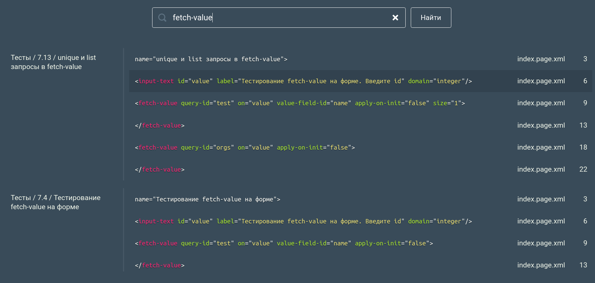
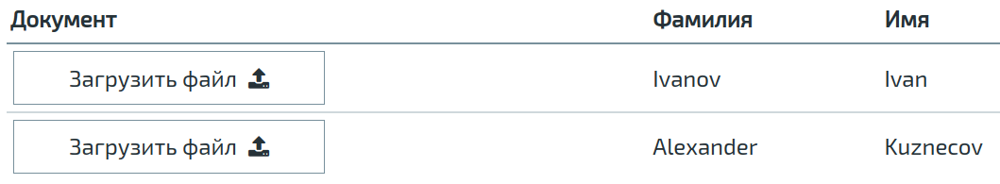
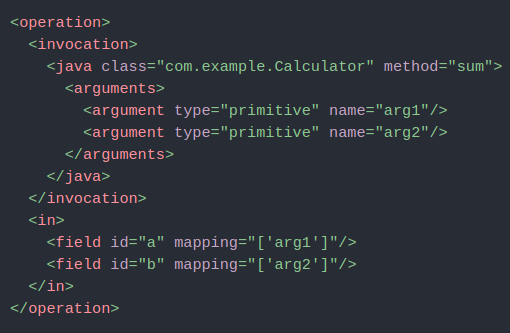

Добрый вечер!
На прошлой неделе мы выпустили N2O Framework 7.18.0.

<!--truncate-->

Одно из самых заметных изменений - это поиск по примерам в Sandbox’е.

Если хотите найти пример использования какого-нибудь атрибута или элемента, просто вбейте его в поиск:

Кликните по найденной строке кода и откроется новый проект сендбокса, сразу на интересующем вас файле.

Поиск не производится по пользовательским проектам, только по нашим примерам, которые можно найти на главной странице.

Мы добавили компонент <file-upload\>, с помощью которого можно отображать и загружать файлы прямо в строках таблицы. Такое хотели использовать в одном из макетов Круга Добра:

Для тех, кто использует java провайдер данных, добавилась возможность мапить данные по именам аргументов java методов, а не индексам, как было раньше.

Это гораздо удобнее, когда у вас несколько аргументов:

Возможность мапить по индексам, как раньше, сохранилась.

В этой версии мы наконец-то занялись архитектурными фичами. Было много совещаний, брейнштормов, техдизайнов. Мы продумывали концепцию развития N2O - что нам делать и куда двигаться дальше. Первые наши архитектурные изменения в моделях данных можно будет увидеть уже в следующей версии.
