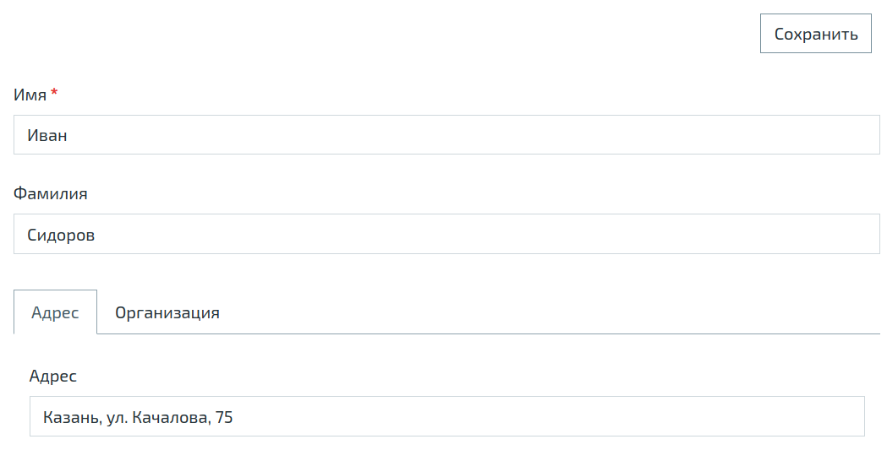
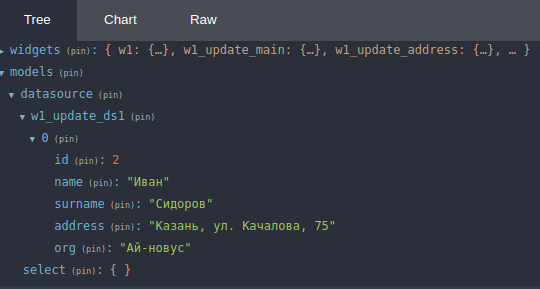
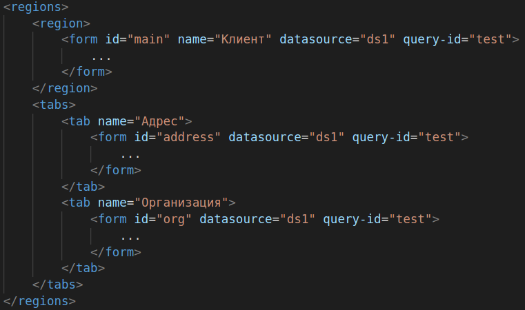
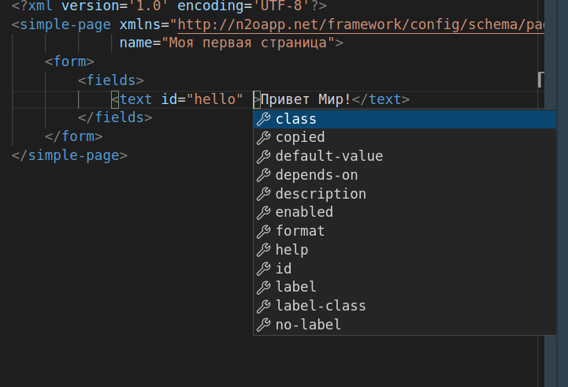
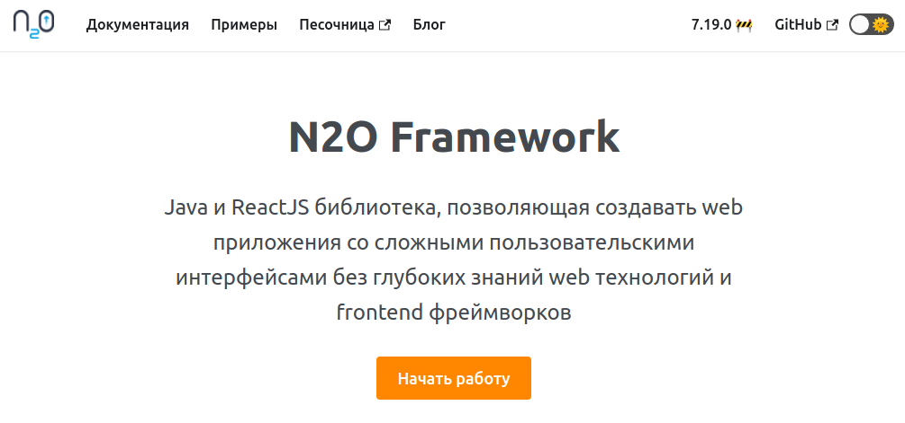

Вчера мы выпустили N2O Framework 7.19.0.
Ниже я расскажу какие важные улучшения были сделаны.

<!--truncate-->

Главное нововведение - это `datasource`.
В N2O существовала давняя архитектурная проблема: данные получает каждый виджет автономно,
нет шаринга данных, нет единой загрузки, нет отправки всех данных разом.
Если нам нужно было разбить заполнение одной сущности по разным вкладкам,
то приходилось несколько раз получать одни и те же данные для каждой вкладки
и добавлять кнопку “Сохранить” в каждую вкладку.

Datasource - это ссылка на виртуальную модель данных в redux, в которой форма хранит текущие данные.

В виджетах (пока только в формах) можно задать атрибут datasource.
Нескольким виджетам можно задать одинаковый datasource:

При сохранении формы на сервер будет отправляться её datasource модель.
Т.е. модель всех форм, ссылающихся на один и тот же datasource.

> Способ загрузки формы (её query-id) должен быть одинаковым у всех форм ссылающихся на один и тот же datasource.
Загружать данные с сервера будет только одна форма, остальные формы будут считаться уже загруженными.

Введение datasource - первый шажок на пути к полному контролю над данными в компонентах N2O.
Дальнейшие шаги будут сильнее менять API, в связи с этим нас ждет page-4.0.

---

В Sandbox’е появилась автоподстановка.
Если забыли какой-либо атрибут или элемент XML, просто нажмите в нужном месте ctrl+space.

Ради этого нам пришлось сменить визуальный редактор кода.
Еще не все функции автоподстановки доступны, например, пока нет валидации типов атрибутов.

---

У нас обновился сайт. Теперь на главной странице новый дизайн от Регины,
интерактивные примеры кода, ссылки на Sandbox.
А еще открылся Блог об N2O!

