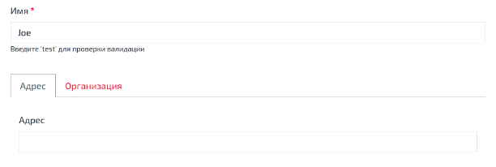
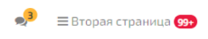
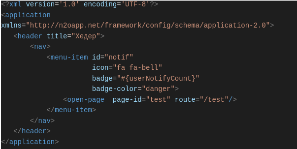
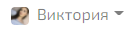
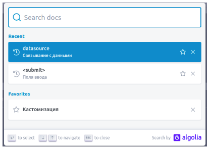

Мы выпустили N2O Framework 7.20.0.
В этой версии есть много чего интересного.

<!--truncate-->

Мы сделали подсветку невалидных вкладок:

Если вы используете один источник данных на несколько форм (фича с datasource)
и некоторые формы спрятаны во вкладках, то возникает проблема валидации полей, находящихся в этих вкладках.
Мы решили подсвечивать все такие вкладки, а первую из них делать активной.

---

В этом квартале мы ведем работу над упрощением внедрения уведомлений и счетчиков в N2O.
Первый шаг - дать возможность вам настроить счетчики в любом месте хедера и сайдбара.
Например, вот так:

Для такой настройки мы разработали новую версию `application-2.0`.
Задать счетчик можно через атрибут `badge`, а цвет счетчика через `badge-color`:

Пока что счетчики не обновляются сами при изменении, например, через web socket.
Сейчас их можно задать либо статично, либо через контекст пользователя `badge=”#{context}”`.
Поддержку обновления через web сокеты планируем добавить в следующих версиях.

Также мы добавили возможность вставки изображений в любые пункты меню.
Картинка задается через атрибут `image`, а форма картинки через `image-shape`:

Это позволит в большинстве случаев не создавать кастомные хедеры для реализации пользовательского меню.

---

И, наконец, мы добавили долгожданный поиск по документации на сайте https://n2oapp.net !

У поиска есть несколько дополнительных возможностей, например,
отображение последних запросов поиска и сохранение в избранное.

