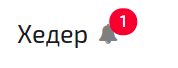

Друзья, мы выпустили крупный релиз N2O Framework 7.21.0.

<!--truncate-->

#### Источники данных

В N2O 7.21 появился новый элемент `<datasource>`.
Это [источник данных страницы](/docs/guides/manual/data#Datasources).

В версии 7.19 мы уже ввели атрибут `datasource` у виджетов.
Он задавал имя виртуальной модели данных, на которую ссылается виджет.
Сейчас же этот атрибут становится ссылкой на источник данных, который создается в элементе `<datasources>` на странице:
```xml
<page xmlns="http://n2oapp.net/framework/config/schema/page-4.0">
    <datasources>
        <!-- Источники данных страницы -->
        <datasource id="persons"
                    query-id="persons"/>
    </datasources>
</page>
```

Это означает, что виджеты больше не отвечают за получение данных.
За получение данных отвечают источники данных.

Несколько виджетов могут ссылаться на один источник данных.
Это дает следующие преимущества:
- Получение данных происходит один раз и сразу для всех
- Если форма меняет свои данные, то эти изменения доступны сразу всем формам с тем же источником данных
- Данные сохраняются не у формы, а у источника данных, а значит все формы можно сохранить одной кнопкой
- Валидации собираются со всех форм одного источника данных и проверяются при отправке на сервер

Больше нет ссылок на виджет, таких как `widget-id` или `ref-widget-id`, которые на самом деле задавали не виджет, а его модель.
Вместо этого используется атрибут `datasource`. Например:
```xml {6}
<button label="Просмотр">
    <show-modal page-id="personCard" route="/:person_id/card">
        <params>
            <path-param name="person_id"
                        value="{id}"
                        datasorurce="persons"
                        model="resolve"/>
        </params>
    </show-modal>
</button>
```
Так же больше нет ссылок на выборку `query-id` и объект `object-id` в виджетах.
Они перенесены в источники данных.

Это довольно существенные изменения, которые привели к созданию новых мажорных версий XSD схем:
`page-4.0`, `region-3.0`, `widget-5.0`, `fieldset-5.0`, `control-3.0`, `cell-3.0`.
Обратная совместимость старых версий схем сохранилась, хотя и есть [некоторые нарушения](/docs/guides/migration/to_7_21#functions).

Мы будем очень рады, если вы попробуете новое api и дадите нам обратную связь!

#### Stomp и Websocket

Источники данных появились не только на странице, но и в структуре приложения `*.application.xml`:

```xml
<?xml version='1.0' encoding='UTF-8'?>
<application xmlns="http://n2oapp.net/framework/config/schema/application-2.0">
    <datasources>
        <!-- Источники данных приложения -->
        <stomp-datasource id="notifCount"
                          destination="/badge"/>
    </datasources>
</application>
```

Источники данных могут работать не только с выборкой, но и через websocket'ы `<stomp-datasource>`.
В качестве протокола взаимодействия с websocket мы используем [stomp](https://stomp.github.io/).

С помощью источников данных приложения можно будет получать данные, которые нужны на любой странице.
Эти данные уже сейчас можно применить в меню навигации в качестве счетчиков:

```xml {3,5,6}
<nav>
    <menu-item id="notif"
               datasource="notifCount"
               icon="fa fa-bell"
               badge="{count}"
               badge-color="{color}">
        <open-page  page-id="test" route="/test"/>
    </menu-item>
</nav>
```



Со стороны сервера для передачи stomp сообщений на клиент через websocket необходимо использовать `SimpMessagingTemplate`:
```js
    @Autowired
    private SimpMessagingTemplate messagingTemplate;

    ...

    BadgeMessage message = new BadgeMessage();
    message.setCount(1);
    message.setColor("danger");
    messagingTemplate.convertAndSendToUser(session.getId(), "badge", message);
```

Подробнее про stomp источники данных можно почитать [здесь](/docs/guides/xml/application/#stomp-datasource).

#### Open-page в новой вкладке

Открывать страницы с хлебными крошками теперь можно в отдельной вкладке.
Для этого достаточно просто указать атрибут `target`:
```xml {3}
<button label="Открыть">
    <open-page page-id="page"
               target="newWindow"/>
</button>
```

#### Полезные ссылки
- [Гид по миграции на 7.21](/docs/guides/migration/to_7_21)
