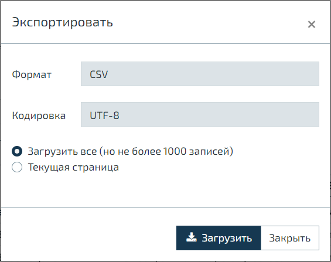

import { Sandbox } from '../src/components/Sandbox/Sandbox'

Мы рады объявить о выпуске релиза N2O Framework 7.24.
Позвольте представить вам новые возможности фреймворка.

<!--truncate-->

#### Пагинация
Была переработана пагинация таблиц и списковых виджетов.
Помимо визуального обновления были добавлены и новые функциональные возможности.

* Одной из них стала **бесконечная пагинация**. Такой вид позволяет скрыть всю информацию о
количестве записей и отобразить только элементы навигации.

<Sandbox height={250} projectId="uxcomponents_pagination_infinite"/>

Задается она следующим образом
```xml
<table>
    ...
    <pagination prev="true" next="true"
                show-last="false" show-count="never"/>
</table>
```

* Еще одной интересной возможностью стала **кнопка для получения количества записей**.

<Sandbox height={250} projectId="uxcomponents_pagination_count_by_request"/>

Для того чтобы появилась кнопка, необходимо использовать `show-count="by-request"`.
Как видите, обе функциональности неплохо сочетаются друг с другом.


Со всеми представлениями пагинаций можно ознакомиться в [документации](/docs/examples/components/pagination)

#### Кнопки настроек таблиц

Продолжая тему таблиц, был расширен набор специальных кнопок.
Они позволяют настраивать визуальное отображение таблицы и взаимодействовать с ее данными.

Если вы не сталкивались с этим раньше, то самое время познакомиться.

<Sandbox height={600} projectId="uxcomponents_tables_settings"/>

В новой версии были добавлены следующие кнопки:

* Кнопка переноса по словам (перенос активен по умолчанию)

* Кнопка экспорта

Экспорт учитывает текущее состояние таблицы (сортировку, фильтры и т.д.) и преобразует ее данные
в файл с указанным расширением и кодировкой.
Можно экспортировать как всю таблицу, так и только текущую страницу.



#### Scrollspy

Переработке подвергся и регион с прокручиваемым меню.
Мы немного привели в порядок его внешний вид.
Однако на этом изменения не заканчиваются.

Теперь в меню навигации можно группировать пункты и задавать заголовок для каждого из них.

<Sandbox height={600} projectId="versions_7.24_scrollspy"/>

#### Badge в &lt;line&gt; филдсете

В &lt;line&gt; филдсете появилась возможность использовать badge.
Это особенно удобно, когда возникает необходимость показать количество заполненных фильтров.
В том числе и в свернутом состоянии филдсета.

<Sandbox height={400} projectId="versions_7.24_badge_line_fieldset"/>

#### Повышение гибкости &lt;parent-datasource&gt; и &lt;app-datasource&gt;

Раньше в этих источниках использовался только атрибут `id`, который являлся и
уникальным идентификатором и ссылкой на другой источник данных.
Такое смешение ответственности давало плюс в виде простоты задания и понимания.
Но также лишало гибкости, т.к. не было возможности в открываемую страницу под одним `id` прокидывать ссылки на разные источники.

В качестве решения был добавлен атрибут `source-datasource`,
который берет на себя функцию ссылки, а `id` по-прежнему остается уникальным идентификатором.

Посмотрите, как это можно реализовать

```xml {8,16}
<page>
    ...
    <toolbar>
        <button label="Btn1">
            <show-modal page-id="modal">
                <datasources>
                    <!-- parentDS ссылается на данные из docs1 -->
                    <parent-datasource id="parentDS" source-datasource="docs1"/>
                </datasources>
            </show-modal>
        </button>
        <button label="Btn2">
            <show-modal page-id="modal">
                <datasources>
                    <!-- parentDS ссылается на данные из docs2 -->
                    <parent-datasource id="parentDS" source-datasource="docs2"/>
                </datasources>
            </show-modal>
        </button>
    </toolbar>
</page>
```

Если вы используете только `id`, то не стоит беспокоиться. Оба подхода совершенно равнозначны и применимы.

#### Полезные ссылки

- [Гид по миграции на 7.24](/docs/guides/migration/to_7_24)
