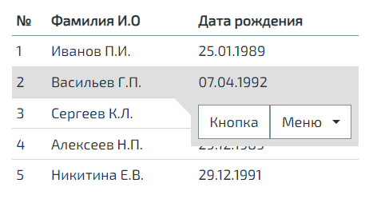

Вышел новый релиз N2O Framework версии 7.26.0.
Новая версия не содержит крупных нововведений,
но предлагает ряд интересных расширений существующего функционала.

<!--truncate-->

#### Валидация зависимых полей

До текущей версии вызов валидации поля срабатывал в нескольких случаях:
- при валидации всей формы по кнопке
- убирание фокуса с поля

Но упускался еще один важный случай:
- перевалидация поля при изменении значений зависимых полей.

В новой версии этот недочет был исправлен без изменений в API.
Теперь поле будет автоматически перевалидироваться, если хоть одно зависимое поле,
указанное в атрибуте `on` было изменено.

В примере ниже поле `input` будет провалидировано каждый раз при изменении значения поля `check`.
```xml
<form>
    <fields>
        <checkbox id="check"/>

        <input-text id="input">
            <validations>
                <condition id="testCheck"
                           message="Для отключения валидации кликните по чекбоксу"
                           on="check">
                    return check
                </condition>
            </validations>
        </input-text>
    </fields>
</form>
```

#### Видимость и доступность вкладки

У вкладок и раньше был механизм для скрытия.
Так, например, вкладка скрывалась, если все виджеты и\или регионы внутри нее также были скрыты.
Этот механизм автоматический, т.к. нет никакого смысла во вкладке без ее содержимого.

Но теперь в дополнении появился более прямой способ взаимодействия - через данные модели.
Уже привычный способ через атрибуты `visible`, `enabled`, используемый во многих визуальных компонентах,
распространился и на вкладки.

```xml
<tabs>
    <tab name="Первая вкладка" datasource="ds"
         enabled="{type.id == 0}">
        ...
    </tab>
    <tab name="Вторая вкладка" datasource="ds"
         visible="{type.id == 1}">
        ...
    </tab>
</tabs>
```

Для указания источника данных был добавлен атрибут `datasource`, а модель мы пока решили ограничить `resolve` значением.

#### Действие &lt;confirm&gt;

После введения мультидействий в версии 7.23 порядок выполнения действий по нажатию на кнопку можно четко задать.
Однако атрибуты кнопки, описывающие появление окна подтверждения (`confirm-`) и
валидации (`validate-`) продолжали выполняться до цепочки действий и не являться ее частью.

Такие атрибуты не дают понимания, когда конкретные действия будут выполнены: в начале или конце цепочки.
Более того, такие действия имеют разовый эффект и не позволяют встраивать их в любое место цепочки.

Первым изменению подверглось действие появления окна подтверждения.
На смену атрибутам `confirm-` пришло действие `<confirm>`.

```xml
<button label="Подтвердить">
    <confirm title="Подтверждение" text="Вы уверены?">
        <ok label="Да"/>
        <cancel label="Нет"/>
    </confirm>
    <!-- действия -->
</button>
```

При появлении окна подтверждения можно нажать на две кнопки.<br/>
Кнопка `ok` - закроет окно и продолжит цепочку действий, следующих после `<confirm>`.<br/>
Кнопка `cancel` - прервет эту цепочку.

Соответственно теперь появилась возможность использовать `<confirm>` в любом месте цепочки и в любом количестве.

#### Тулбар в выделенной строке таблицы

В версии 7.25 мы отказались от атрибута таблицы, отображающего тулбар строки при наведении на эту строку (`hide-on-blur`),
и решили взять время на переработку этого функционала.

Теперь эта возможность более логично встроена в элемент `<rows>` с чуть улучшенным визуалом.

```xml
<table>
    ...
    <rows>
        <overlay>
            <toolbar>
                <button label="Кнопка"/>
                <sub-menu label="Меню">
                    ...
                </sub-menu>
            </toolbar>
        </overlay>
    </rows>
</table>
```



#### Кнопка-поле. Сообщение о причине недоступности

Ранее кнопка-поле в отличие от кнопки тулбара не могла выводить сообщение о причине недоступности.
В новой версии мы устранили эту оплошность, добавив зависимости `<enabling>` кнопки-поля атрибут `message`.

```xml
<form>
    <fields>
        <button label="Кнопка-поле" description="Сообщение, если кнопка доступна">
            <dependencies>
                <enabling on="check" message="Сообщение о причине недоступности">
                    check
                </enabling>
            </dependencies>
        </button>
    </fields>
</form>
```

#### Встроенные функции нормализации даты и времени

Часто при работе с датами возникает необходимость сделать преобразование из одного формата в другой.
Для подобных целей мы добавили в n2o несколько встроенных функций нормализации, которые бы в этом помогли.

Например, функция `dateWithOutput` позволяет преобразовать дату из ISO формата в указанный.
```xml
<field id="birthday" normalize="#dateWithOutput(#this, 'dd.M.yyyy')"/>
```
```
Входные данные:
"2022-09-12", "dd.M.yyyy"

Выходные данные:
"12.9.2022"
```

Единственное ограничение, о котором важно помнить, что на вход этим функциям должно поступать значение даты типа `String`.
Со списком всех доступных функций нормализации дат и времени можно ознакомиться [здесь](https://n2o.i-novus.ru/docs/guides/manual/data#date_normalizer_functions).

#### Полезные ссылки

- [Гид по миграции на 7.26](/docs/guides/migration/to_7_26)
