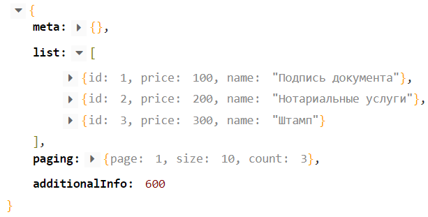

import { Sandbox } from '../src/components/Sandbox/Sandbox'

Мы выпустили версию 7.27.0 N2O Framework.<br/>
В первую очередь эта версия ознаменована долгожданным появлением вложенных мультисетов.
Также очередное развитие получили валидации, редактируемые ячейки и еще много чего интересного.

<!--truncate-->

#### Вложенные мультисеты

Мультисеты получили возможность вкладываться друг в друга и таким образом строить сложные списковые иерархии.

Для обращения к элементу мультисета ранее использовалось ключевое слово `index`.
Здесь представлены примеры для обращения к мультисету с именем **groups**:
- `groups[index]` - для обращения к элементу под номером `index`
- `groups[index].name` - для обращения к полю `name` элемента под номером `index`

Это ключевое слово остается.
Для обращения же к вложенным мультисетам нужно использовать ключевые слова `$index_N`,
где N - это уровень вложенности, начиная с 1 (`$index_1`, `$index_2`, ...).
Аналогом для `index` будет `$index_0`.

Примеры таких обращений:
- `groups[index].members[$index_1]`
- `groups[index].members[$index_1].name`
- `groups[index].members[$index_1].documents[$index_2]`

```xml
<multi-set id="groups" label="Список групп"
           children-label="Группа {index}">
    <multi-set id="members" label="Список участников"
               children-label="Участник {index}.{$index_1}">
        ...
        <input-text id="field" enabled="{groups[index].members[$index_1].type == '1'}"/>
        ...
    </multi-set>
</multi-set>
```

Таким образом, на каком бы уровне вложенности не находилось поле, валидация, зависимость и т.д.,
для обращения всегда нужно указывать полный путь от первого мультисета до требуемого.
За счет этого можно обращаться как к нижележащим, так и к вышележащим данным.

#### Кнопки поиска

Существующий элемент `<search-buttons>` включает в себя сразу 2 кнопки и это не всегда удобно.
Нередко возникали случаи, когда была необходимость только в одной.
Поэтому были добавлены отдельные кнопки для поиска `<search-button>` и для очистки `<clear-button>` соответственно.

```xml
<search-button label="Найти" color="secondary"/>
```

```xml
<clear-button label="Сбросить" color="danger"/>
```

К тому же это добавляет больше возможностей для визуальной настройки конкретной кнопки.

#### Серверная валидация по мере ввода

Добавлена возможность вызывать `<constraint>` валидацию по мере ввода данных на клиенте.

<Sandbox height={400} projectId="interactions_validation_dynamic_constraint"/>

Для этого нужно задать ее в качестве валидации поля.

```xml
<input-text id="username" label="Чтобы проверить введите Anna">
    <validations>
        <constraint id="checkUniqueName"
                    message="Пользователь с таким именем уже существует в системе"
                    result = "[0].get('count') == 0">
            <invocation>...</invocation>
            <in>
                <field id="username"/>
            </in>
        </constraint>
    </validations>
</input-text>
```

#### Доступ к дополнительной информации через `$additional`

В версии 7.23 мы уже сделали попытку внедрить поле `additionalInfo` в возвращаемую на клиент модель.
Это особенно удобно, когда возвращаются списковые данные (например для таблицы) и
рядом с ними необходимо прислать дополнительную информацию.

Посмотрите, как это может выглядеть. В данном случае были просуммированы поля **price** всех записей.



С помощью атрибута `additional-mapping` элемента `<list>` выборки можно,
как сослаться на конкретное поле ответа сервера, так и собрать значение с помощью SpEL выражения.

Однако до текущей версии не было никакой возможности (кроме кастомных компонентов) использовать эту информацию.
Спешим сообщить, что теперь эта оплошность исправлена и к дополнительной информации можно обратиться
с помощью ключевого слова `$additional`.

```xml
<toolbar>
    <button label="Все ({ $additional.all })"/>
    <button label="Непрочитанные ({ $additional.new })"/>
    <button label="В архиве ({ $additional.archived })"/>
</toolbar>
```

#### Редактируемая ячейка. Офлайн режим

Редактируемой ячейке добавлен офлайн режим, позволяющий менять значение на клиенте, но не отправлять его сразу же на сервер.

Для того чтобы использовать этот функционал, достаточно не указывать действие у `edit` ячейки.

```xml
<table>
    <toolbar>
        <button label="Отправить">...</button>
    </toolbar>

    <columns>
        ...
        <column text-field-id="name" label="Фамилия И.О">
            <edit>
                <input-text id="name"/>
            </edit>
        </column>
    </columns>
</table>
```

После того как все желаемые значения в ячейках изменены на новые, можно одной кнопкой массово сохранить все измененные строки.

#### Badge в филдсетах

В дополнении к `<line>` филдсету `badge-` атрибуты также были добавлены в `<set>` и `<multi-set>`.

```xml
<line label="line"
      badge="{name}"
      badge-color="primary"/>
```

```xml
<set label="set"
     badge="{name}"
     badge-position="right"/>
```

```xml
<multi-set id="multi" label="multi"
           badge="{name}"
           badge-shape="square">
    ...
</multi-set>
```

#### Полезные ссылки

- [Гид по миграции на 7.27](/docs/guides/migration/to_7_27)
- [Вложенные мультисеты](/docs/guides/manual/components#multiset_nesting)
