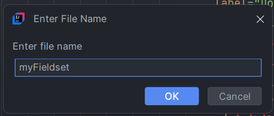

Вышла новая версия N2o плагина для Intellij Idea. В нее вошло пару очень полезных возможностей.

<!--truncate-->

#### Переход к настройкам из xml

Теперь, если вы кликните (`CTRL+B`, `CTRL+ЛКМ`, `СКМ`) по настройке в xml файле,
произойдет переход к .properties файлу, в котором содержится эта настройка.

Если же таких файлов больше одного, то появится контекстное меню, в котором вы можете выбрать куда перейти.

#### Вынесение филдсетов, сайдбаров, виджетов в отдельный файл

Содержимое всех xml компонентов с атрибутом `ref-id` можно вынести в отдельный файл.
Для этого делаем следующее:
1. Ставим курсор на открывающий тэг и нажимаем `ALT+INSERT`
2. В появившемся контекстном меню **Generate** выбираем "N2o. Reference file"

   
3. Осталось только дать имя новому файлу

   

Плагин автоматически создаст новый файл рядом с текущим, перенесет в него все содержимое тэга и
пропишет ссылку на файл в атрибуте `ref-id`.

