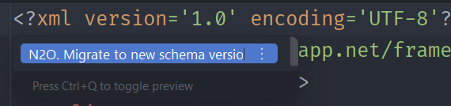
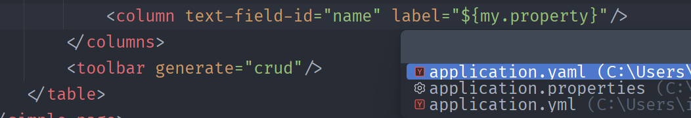

Вышла свежая версия N2o плагина, которая сделает вашу работу в IntelliJ IDEA еще комфортнее.

<!--truncate-->

#### 1. Автоматическая миграция XML-файлов

Добавлена возможность автоматической миграции XML-файлов со старой версии схемы на новую.

Для запуска миграции достаточно открыть файл, вызвать контекстное меню с помощью `Alt + Enter`
и выбрать пункт **"N2O: Migrate to new schema version"**.

После выполнения действия содержимое файла будет автоматически обновлено в соответствии с новой версией Xml API.

Поддерживаемые миграции xsd схем:
- `application-2.0` → `application-3.0`
- `query-4.0` → `query-5.0`
- `page-3.0` → `page-4.0`
- `n2o-widget-4.0` → `widget-5.0`
- `fieldset-4.0` → `fieldset-5.0`

При использовании миграции важно учитывать несколько особенностей:
- порядок атрибутов может измениться
- порядок некоторых тегов также может быть изменён, если их взаимное расположение не влияет на структуру или поведение 
  Например, внутри формы тег `<toolbar>` может быть перемещён перед `<fields>`.
  Это никак не повлияет на UI или функциональность приложения
- комментарии в XML-файлах не сохраняются и будут удалены

Функционал автоматической миграции позволяет значительно сократить время на ручное обновление схем.
Тем не менее с учётом перечисленных ограничений, в отдельных случаях результат может потребовать дополнительной ручной корректировки.

#### 2. Переход к настройкам из yaml\yml

В версии 1.9 была добавлена поддержка поиска по `.properties`-файлам.
В текущем обновлении этот функционал расширен также на файлы форматов `.yaml` и `.yml`.

Теперь поиск выполняется по всем перечисленным типам файлов.

Кроме того, при выборе варианта в контекстном меню осуществляется переход непосредственно к строке файла,
в которой найдено соответствующее значение.

#### Исправление багов

##### 1. Неверная ассоциация *.xml файлов с N2O плагином

Баг мог проявляться разным образом. Например, не работал переход между зависимостями в pom.xml,
когда протыкивание зависимости ни к чему не приводило.  
Еще один случай заключался в невозможности переименования xml файла, использующегося в liquibase.

Причина заключалась в том, что начиная с определенной версии IDEA, плагин стал ассоциироваться со
всеми xml файлами. Если зайти в настройки `Editor -> File Types`, то окажется, что `N2O` забрал на себя все `*.xml` файлы,
тогда как у самого `XML` этого расширения не будет.

Проблема была исправлена, но не забудьте проверить в вашей IDEA, что `*.xml` теперь ассоциированы с `XML`, а не `N2O`.
Иначе измените связь вручную.

##### 2. Ошибка плагина, возникающая при старте IntelliJ IDEA версии 2025.1+

