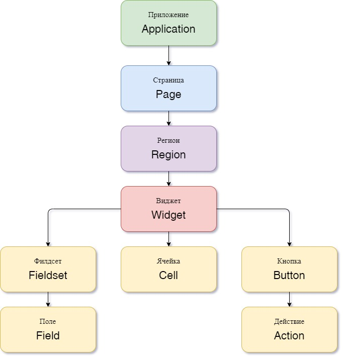

N2O - компонентно-ориентированный фреймворк.
Визуальные компоненты разработаны на React.
Компоненты имеют иерархическую структуру.



### Структура приложения

Структура приложения - описание компонентов общих для всего приложения:
заголовок с навигацией, боковая панель, подвал.
Структура приложения задается в файле `*.application.xml`.
Обычно в приложении существует только один файл `application.xml`
Если их несколько, то необходимо задать идентификатор структуры приложения в настройке `n2o.application.id`.

```xml title="Структура приложения"
<?xml version='1.0' encoding='UTF-8'?>
<application xmlns="http://n2oapp.net/framework/config/schema/application-1.0"
        welcome-page-id="index">
  <header>
    ...
  <header>
  <sidebar>
    ...
  </sidebar>
  <footer>
      ...
  </footer>
</application>
```

#### Шапка (header)

Шапка (header) - это заголовок каждой страницы,
содержащий логотип и название, меню навигации, меню пользователя и строку поиска по приложению.

```xml title="Структура шапки"
<?xml version='1.0' encoding='UTF-8'?>
<application xmlns="http://n2oapp.net/framework/config/schema/application-1.0">
    <header title="Мое приложение">
      <nav>
        ...
      </nav>
      <extra-menu>
        ...
      </extra-menu>
    </header>
</application>
```

#### Боковая панель

Боковая панель - содержит меню навигации, может содерждать логотип и название.

```xml title="Структура бооковой панели"
<?xml version='1.0' encoding='UTF-8'?>
<application xmlns="http://n2oapp.net/framework/config/schema/application-1.0">
    <sidebar title="Мое приложение">
      <nav>
        ...
      </nav>
      <extra-menu>
        ...
      </extra-menu>
    </sidebar>
</application>
```

#### Подвал (footer)

Подвал (footer) - информация, отображаемая внизу страницы.

```xml title="Структура подвала"
<?xml version='1.0' encoding='UTF-8'?>
<application xmlns="http://n2oapp.net/framework/config/schema/application-1.0">
    <footer left-text="N2O ${n2o.version}"/>
</application>
```

### Меню навигации

Меню навигации задаётся в файлах вида `*.menu.xml`:

```xml title="Меню навигации в отдельном файле"
<?xml version='1.0' encoding='UTF-8'?>
<nav xmlns="http://n2oapp.net/framework/config/schema/menu-2.0">
  <page page-id="menu1" label="Первая страница"/>
  <page page-id="menu2" label="Вторая страница"/>
  ...
</nav>
```

Либо перечисляется внутри элементов `<nav>` и `<extra-menu>` шапки или боковой панели:

```xml title="Меню навигации в приложении"
<?xml version='1.0' encoding='UTF-8'?>
<application xmlns="http://n2oapp.net/framework/config/schema/application-1.0">
    <header title="Мое приложение">
        <nav>
          <page page-id="menu1" label="Первая страница"/>
          <page page-id="menu2" label="Вторая страница"/>
        </nav>
    </header>
    <sidebar title="Мое приложение">
        <extra-menu>
          <page page-id="menu1" label="Первая страница"/>
          <page page-id="menu2" label="Вторая страница"/>
        </extra-menu>
    </sidebar>
</application>
```

На меню навигации, заданному в отдельном файле, можно ссылаться
через атрибут `ref-id` в элементах `<nav>` и `<extra-menu>` шапки или боковой панели:

```xml title="Ссылка на меню навигации"
<?xml version='1.0' encoding='UTF-8'?>
<application xmlns="http://n2oapp.net/framework/config/schema/application-1.0">
    <header title="Мое приложение">
        <nav ref-id="myMenu"/>
    <sidebar title="Мое приложение">
        <extra-menu ref-id="myMenu"/>
    </sidebar>
</application>
```

**Виды меню навигации**

|Вид                     |Описание                       |
|------------------------|-------------------------------|
|`<page>`                |Ссылка на страницу N2O         |
|`<a>`                   |Ссылка на произвольную страницу|
|`<sub-menu>`            |Вложенное меню                 |

### Страница

Приложения на N2O состоят из страниц.
Страницы задаются в файлах вида `*.page.xml`.
Страницы могут иметь простую или сложную разметку.

Простая страница содержит один единственный компонент-виджет,
занимающий всё свободное пространство.

```xml title="Простая страница"
<simple-page xmlns="http://n2oapp.net/framework/config/schema/page-3.0"
  name="Моя страница">
  <form>...</form><!-- Виджет -->
</simple-page>
```


Сложные страницы поделены на регионы,
которые могут располагаться в разных областях страницы.

```xml title="Стандартная страница"
<?xml version='1.0' encoding='UTF-8'?>
<page xmlns="http://n2oapp.net/framework/config/schema/page-3.0"
  name="Моя страница">
  <regions>
    <!-- Регионы -->
  </regions>
</page>
```


```xml title="Страница с разметкой регионов "слева и справа""
<?xml version='1.0' encoding='UTF-8'?>
<left-right-page xmlns="http://n2oapp.net/framework/config/schema/page-3.0"
      name="Моя страница">
  <left>
    <panel>...</panel>
  </left>
  <right>
    <panel>...</panel>
  </right>
</page>
```


```xml title="Страница с разметкой регионов "сверху, слева и справа""
<?xml version='1.0' encoding='UTF-8'?>
<top-left-right-page xmlns="http://n2oapp.net/framework/config/schema/page-3.0"
      name="Моя страница">
  <top>
    <panel>...</panel>
  </top>
  <left width="30%">
    <panel>...</panel>
  </left>
  <right width="70%">
    <panel>...</panel>
  </right>
</page>
```


```xml title="Страница с поисковой строкой"
<?xml version='1.0' encoding='UTF-8'?>
<searchable-page xmlns="http://n2oapp.net/framework/config/schema/page-3.0"
      name="Моя страница">
  <search-bar search-filter-id="name" search-param="name"/>
  <regions>
    <!-- Регионы -->
  </regions>
</searchable-page>
```


__*Виды страниц*__

|Вид                        |React компонент |Описание                                                                                 |
|---------------------------|----------------|-----------------------------------------------------------------------------------------|
|&lt;simple-page&gt;        |SimplePage      |[Страница с единственным виджетом](../xml/page#simple-page)                              |
|&lt;page&gt;               |StandardPage    |[Страница с регионами](../xml/page#page)                                                 |
|&lt;left-right-page&gt;    |LeftRightPage   |[Страница с разметкой регионов "слева и справа"](../xml/page#left-right-page)            |
|&lt;top-left-right-page&gt;|TopLeftRightPage|[Страница с разметкой регионов "сверху, слева и справа"](../xml/page#top-left-right-page)|
|&lt;searchable-page&gt;    |SearchablePage  |[Страница с поисковой строкой](../xml/page#searchable-page)                              |

### Регион

В регион могут вкладываться произвольное количество виджетов и регионов.
Регионы имеют свою верстку для различной компоновки виджетов.

```xml title="Регион в виде вкладок"
<regions>
  <tabs>
    <!-- Вкладки -->
    <tab name="Один">...</tab>
    <tab name="Два">...</tab>
    ...
  </tabs>
</regions>
```


__*Виды регионов*__

|Вид           |React компонент|Описание                                                                                   |
|--------------|---------------|-------------------------------------------------------------------------------------------|
|&lt;region&gt;|NoneRegion     |[Виджеты без обрамления](../xml/page#region)         |
|&lt;tabs&gt;  |TabsRegion     |[Виджеты во вкладках](../xml/page#tabs)              |
|&lt;panel&gt; |PanelRegion    |[Виджеты в панелях](../xml/page#panel)               |
|&lt;line&gt;  |ListRegion     |[Горизонтальная черта над виджетом](../xml/page#line)|

### Виджет

Виджеты отображают и управляют данными одного объекта.
Виджеты задаются в файлах вида `*.widget.xml`:

```xml title="Виджет в отдельном файле"
<?xml version='1.0' encoding='UTF-8'?>
<table xmlns="http://n2oapp.net/framework/config/schema/widget-4.0"
       name="Моя таблица">
    ...
</table>
```

Можно вкладывать виджеты в страницу:

```xml title="Виджет внутри страницы"
<?xml version='1.0' encoding='UTF-8'?>
<simple-page xmlns="http://n2oapp.net/framework/config/schema/page-3.0">
  <table name="Моя таблица">
      ...
  </table>
</simple-page>
```

Или в регион:

```xml title="Виджет внутри региона"
<?xml version='1.0' encoding='UTF-8'?>
<page xmlns="http://n2oapp.net/framework/config/schema/page-3.0">
  <regions>
    <table name="Моя таблица">
          ...
    </table>
  </regions>
</page>
```

__*Виды основных виджетов*__

|Вид          |React компонент|Описание                                                          |
|-------------|---------------|------------------------------------------------------------------|
|&lt;form&gt; |FormWidget     |[Форма](../xml/widget#form)    |
|&lt;table&gt;|TableWidget    |[Таблица](../xml/widget#table) |
|&lt;list&gt; |ListWidget     |[Список](../xml/widget#list)   |
|&lt;tree&gt; |TreeWidget     |[Дерево](../xml/widget#tree)   |
|&lt;cards&gt;|CardsWidget    |[Карточки](../xml/widget#cards)|
|&lt;tiles&gt;|TilesWidget    |[Плитки](../xml/widget#tiles)  |

Описание других виджетов можно посмотреть [здесь](../xml/widget).

#### Таблица

Таблица - виджет N2O, представляющий данные в виде таблицы
с возможностью сортировки, фильтрации, паджинации.

```xml title="Виджет таблица"
<?xml version='1.0' encoding='UTF-8'?>
<table xmlns="http://n2oapp.net/framework/config/schema/widget-4.0"
  name="Моя таблица"
  query-id="table">
  <columns>
    <column text-field-id="firstName" label="Имя"/>
    <column text-field-id="lastName" label="Фамилия"/>
  </columns>
</table>
```


Столбцы таблицы задаются внутри элемента `<columns>`.

#### Форма

Форма - виджет N2O, представляющий одну запись данных
в виде полей с возможностью просмотра или редактирования.

```xml title="Виджет форма"
<?xml version='1.0' encoding='UTF-8'?>
<form xmlns="http://n2oapp.net/framework/config/schema/widget-4.0"
  name="Моя форма">
  <fields>
    <input-text id="firstName" label="Имя"/>
    <input-text id="lastName" label="Фамилия"/>
  </fields>
</form>
```


Поля формы задаются внутри элемента `<fields>`.

#### Автоматическое сохранение данных формы

В N2O есть возможность автоматически сохранять данные формы без необходимости
нажатия кнопки. Для этого используется действие формы `<submit>`.

```xml title="Автоматическое сохранение формы"
<?xml version='1.0' encoding='UTF-8'?>
<form xmlns="http://n2oapp.net/framework/config/schema/widget-4.0"
      name="Моя форма">
  <fields>
    <input-text id="firstName" label="Имя"/>
    <input-text id="lastName" label="Фамилия"/>
  </fields>
  <submit operation-id="update"/>
</form>
```

### Кнопки и действия {#Buttons_and_Actions}

В N2O можно вызывать различные действия над виджетами:
открытие страниц, ссылок, выполнение запросов на сервер и т.п.

#### Панель кнопок

Кнопки задаются в теле виджета внутри панели инструментов `<toolbar>`:

```xml title="Кнопки виджета"
<table>
  <toolbar>
    <button>...</button>
    <button>...</button>
    ...
  </toolbar>
</table>
```

Элемент `<toolbar>` так же можно задать на странице:

```xml title="Кнопки страницы"
<page>
    <toolbar>
      <button>...</button>
      <button>...</button>
      ...
    </toolbar>
</page>
```
В этом случае в кнопках необходимо уточнить над каким виджетом они выполняют действия:

```xml title="Виджет над которым произойдет действие кнопки"
<page>
  <toolbar>
    <button widget-id="main">...</button>
  </toolbar>
</page>
```

Можно задать местоположение панели кнопок через атрибут `place`:

```xml title="Позиция кнопок"
<toolbar place="topLeft">
  ...
</toolbar>
<toolbar place="bottomRight">
  ...
</toolbar>
```

:::note

Местоположение панели кнопок зависит от реализации React компонента страницы и виджета.

:::

Кнопки можно соединять в группы:

```xml title="Группа кнопок"
<toolbar>
  <group>
    <button>...</button>
    <button>...</button>
    ...
  </group>
  <group>
    ...
  </group>
</toolbar>
```

#### Кнопка

Кнопка - это визуальный элемент, на который можно нажать для выполнения действия.
Кнопка может иметь разный размер, цвет, верстку:

```xml title="Иконка кнопки"
<button label="Кнопка"/>
<button label="Кнопка  с иконкой" icon="fa fa-plus"/>
<button label="Иконка" icon="fa fa-pencil" type="icon"/>
```


```xml title="Цвет кнопки"
<button label="Главная" color="primary"/>
<button label="Опасная" color="danger"/>
<button label="Ссылка" color="link"/>
```


```xml title="Кнопка с выпадающим списком"
<sub-menu label="Меню">
  <menu-item label="Один">...</menu-item>
  <menu-item label="Два">...</menu-item>
</sub-menu>
```


Кнопка является React компонентом и имеет несколько реализаций:

__*Виды кнопок*__

|Вид             |React компонент|Описание                                                                           |
|----------------|---------------|-----------------------------------------------------------------------------------|
|&lt;button&gt;  |PerformButton  |[Кнопка с действием](../xml/widget#button_in_widget)      |
|&lt;sub-menu&gt;|DropdownButton |[Кнопка с вложенным меню](../xml/widget#sub-menu_in_widget)|

#### Действие кнопки

Кнопки вида `<button>` при нажатии выполняют определенное действие над виджетом.
Большинство действий выполняется с помощью библиотеки [Redux](https://redux.js.org/).
Действия Redux меняют состояние React компонентов и отправляют запросы на сервер.

__*Виды действий*__

|Вид               |Redux действие             |Описание                                                                          |
|------------------|---------------------------|----------------------------------------------------------------------------------|
|&lt;invoke&gt;    |n2o/actionImpl/START_INVOKE|[Отправка данных формы](../xml/action#invoke)                                     |
|&lt;show-modal&gt;|n2o/modals/INSERT          |[Открытие модального окна](../xml/action#show-modal)                              |
|&lt;open-page&gt; |                           |[Открытие вложенной страницы](../xml/action#open-page)                            |
|&lt;close&gt;     |n2o/modals/CLOSE           |[Закрытие модального окна или возврат на предыдущую страницу](../xml/action#close)|
|&lt;refresh&gt;   |n2o/widgets/DATA_REQUEST   |[Обновление данных виджета](../xml/action#refresh)                                  |
|&lt;clear&gt;     |n2o/widgets/DATA_REQUEST   |[Очистка данных виджета](../xml/action#clear)                                     |
|&lt;copy&gt;      |n2o/widgets/DATA_REQUEST   |[Копирование данных виджета из одной модели в другую](../xml/action#copy)         |
|&lt;print&gt;     |n2o/toolbar/PRINT_BUTTON   |[Печать документа](../xml/action#print)                                             |

Действие можно задать внутри кнопки:

```xml title="Действие внутри кнопки"
<button label="Изменить">
  <invoke operation-id="update"/>
</button>
```

Либо в элементе `<actions>` в теле виджета:

```xml title="Действие, заданное отдельно от кнопок"
<table>
  <actions>
    <action id="create" label="Создать">
      <show-modal
        page-id="myForm"
        submit-operation-id="create"/>
    </action>
  </actions>
</table>
```

На одно и тоже действие виджета можно ссылаться из различных мест,
которые могут выполнять действия, например, из кнопок:

```xml title="Ссылка на действие в кнопке"
<button action-id="create"/>
```

### Филдсеты

Филдсеты группируют [поля](../xml/field)
и другие филдсеты со своей вёрсткой и логикой.
Филдсеты задаются в файлах вида `*.fieldset.xml`.

```xml title="Филдсет отдельным файлом"
<?xml version='1.0' encoding='UTF-8'?>
<set xmlns="http://n2oapp.net/framework/config/schema/fieldset-4.0">
  ...
</set>
```

Либо можно задать филдсет внутри формы:

```xml title="Филдсет внутри формы"
<form>
  <fields>
    <set>
      ...
    </set>
  </fields>
</form>
```

__*Виды филдсетов*__

|Вид         |React компонент |Описание                                                                                  |
|------------|----------------|------------------------------------------------------------------------------------------|
|&lt;set&gt; |StandardFieldset|[Филдсет без верстки](../xml/fieldset#set)             |
|&lt;line&gt;|LineFieldset    |[Филдсет с горизонтальной чертой](../xml/fieldset#line)|

В филдсете поля можно расположить в строку или столбец
с помощью элементов `<row>` и `<col>`.


```xml title="Расположение полей в строку или столбец"
<fields>
  <set>
    <row>
      <!-- Первая строка с двумя столбцами -->
      <col size="8">
        ... <!-- Поля первого столбца -->
      </col>
      <col size="4">
        ... <!-- Поля второго столбца -->
      </col>
    </row>
    <row>
      ... <!-- Вторая строка -->
    </row>
  </set>
</fields>
```

Ширина столбца `<col>` задается атрибутом `size`.
Всего доступно 12 размеров согласно сетке [Bootstrap](https://getbootstrap.com/docs/4.0/layout/grid/).

__*Мульти-филдсеты*__

Существует возможность создавать филдсеты с динамическим числом полей.
При нажатии кнопки добавления в филдсет будет добавлено еще одно поле или набор полей.
Также имеется возможность удаления полей и копирования.

С помощью `{index}` можно управлять нумерацией заголовков дочерних элементов
(Например: "Участник 1", "Участник 2" и т.д.). По умолчанию нумерация с нуля.
Для задания нумерации с единицы воспользуйтесь выражением `{(index + 1)}`.

```xml
<form>
    <fields>
        <multi-set id="members" children-label="Участник {index}" add-label="Добавить участника"
                   can-remove-all="true" remove-all-label="Удалить всех участников" can-copy="true">
            ...
        </multi-set>
    </fields>
</form>
```

### Поля ввода {#Input_fields}

Поля ввода - это простейшие компоненты N2O, предназначенные для ввода или вывода различных данных.
Поля могу содержать заголовок, подсказку, сообщения валидации и многое другое.

Поля перечисляются на форме в элементе `<fields>`:


```xml
<form>
  <fields>
    <input-text id="name" label="Наименование"/>
  </fields>
</form>
```

Либо вкладываются в филдсет:


```xml title=""
<line>
  <input-text id="name" label="Наименование"/>
</line>
```

Все поля должны иметь уникальный в рамках виджета идентификатор `id`.
По нему происходит (#_Связывание_с_данными[связывание с данными].

__*Основные виды полей*__

|Вид                      |React компонент      |Описание                                                                                                                         |
|-------------------------|---------------------|---------------------------------------------------------------------------------------------------------------------------------|
|&lt;input-text&gt;       |InputText InputNumber|[Поле ввода текста или чисел](../xml/field#input-text)                                       |
|&lt;output-text&gt;      |OutputText           |[Поле вывода текста](../xml/field#output-text)                                               |
|&lt;checkbox&gt;         |Checkbox             |[Поле чекбокса](../xml/field#checkbox)                                                       |
|&lt;date-time&gt;        |DatePicker           |[Поле ввода даты и времени](../xml/field#date-time)                                          |
|&lt;select&gt;           |Select               |[Поле выбора из выпадающего списка](../xml/field#select)                                     |
|&lt;input-select&gt;     |InputSelect          |[Поле ввода текста с выбором из выпадающего списка](../xml/field#input-select)               |
|&lt;radio-group&gt;      |RadioGroup           |[Поле группы радио кнопок](../xml/field#radio-group)                                         |
|&lt;checkbox-group&gt;   |CheckboxGroup        |[Поле группы чекбоксов](../xml/field#checkbox-group)                                         |
|&lt;text-area&gt;        |TextArea             |[Многострочное поле ввода](../xml/field#text-area)                                           |
|&lt;input-select-tree&gt;|InputSelectTree      |[Компонент ввода с выбором в выпадающем списке в виде дерева](../xml/field#input-select-tree)|
|&lt;text&gt;             |Text                 |[Компонент текста](../xml/field#text)                                                        |
|&lt;text-editor&gt;      |TextEditor           |[Компонент редактора текста](../xml/field#text-editor)                                       |
|&lt;date-interval&gt;    |DateInterval         |[Компонент ввода интервала дат](../xml/field#date-interval)                                  |
|&lt;code-editor&gt;      |CodeEditor           |[Компонент редактора кода](../xml/field#code-editor)                                         |
|&lt;file-upload&gt;      |FileUpload           |[Компонент загрузки файлов](../xml/field#file-upload)                                        |
|&lt;slider&gt;           |Slider               |[Компонент ползунок](../xml/field#slider)                                                    |
|&lt;time-picker&gt;      |TimePicker           |[Компонент ввода времени](../xml/field#time-picker)                                          |

Описание других видов полей можно посмотреть [здесь](../xml/field).

### Ячейка

Ячейки - это простейшие компоненты, которые отображают информацию в записях таблицы или списка.

Ячейки встраиваются в столбцы таблицы:


```xml title="Ячейка-текст в таблице"
<table>
  <columns>
    <column text-field-id="birthday">
      <text format="date DD.MM.YYYY"/>
    </column>
  </columns>
</table>
```

Или в содержимое виджета-списка:


```xml title="Ячейка-текст в виджете-список"
<list>
  <content>
    <body text-field-id="birthday">
      <text format="date DD.MM.YYYY"/>
    </body>
  </content>
</list>
```

```xml title="Переключаемые ячейки"
<switch value-field-id="type">
    <case value="type1">
        <badge.../>
    </case>
    <case value="type2">
        <icon.../>
    </case>
    ...
    <default>
        <text/>
    </default>
</switch>
```

Предоставляют возможность использовать различные виды ячеек в колонке в зависимости от условия.

__*Основные виды ячеек*__

|Элемент         |React компонент|Описание                                   |
|----------------|---------------|-------------------------------------------|
|&lt;text&gt;    |TextCell       |[Текстовая ячейка](../xml/cell#text)       |
|&lt;badge&gt;   |BadgeCell      |[Ячейка значок](../xml/cell#badge)         |
|&lt;icon&gt;    |IconCell       |[Ячейка иконка](../xml/cell#icon)          |
|&lt;link&gt;    |LinkCell       |[Ячейка ссылка](../xml/cell#link)          |
|&lt;checkbox&gt;|CheckboxCell   |[Ячейка чекбокс](../xml/cell#checkbox)     |
|&lt;toolbar&gt; |ToolbarCell    |[Ячейка с меню кнопок](../xml/cell#toolbar)|
