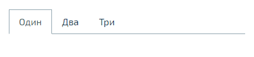
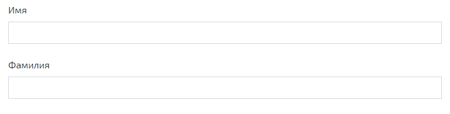
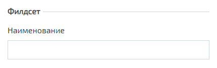
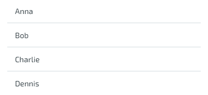

N2O - компонентно-ориентированный фреймворк.
Визуальные компоненты разработаны на React.
Компоненты имеют иерархическую структуру.


### Страница

Приложения на N2O состоят из страниц.
Страницы задаются в файлах вида `*.page.xml`.
Страницы могут иметь простую или сложную разметку.

Простая страница содержит один единственный компонент-виджет,
занимающий всё свободное пространство.


```xml title="Простая страница"
<simple-page xmlns="http://n2oapp.net/framework/config/schema/page-3.0"
  name="Моя страница">
  <form>...</form><!-- Виджет -->
</simple-page>
```

Сложные страницы поделены на регионы,
которые могут располагаться в разных областях страницы.


```xml title="Стандартная страница"
<?xml version='1.0' encoding='UTF-8'?>
<page xmlns="http://n2oapp.net/framework/config/schema/page-3.0"
  name="Моя страница">
  <regions>
    <!-- Регионы -->
  </regions>
</page>
```


```xml title="Страница с разметкой регионов "слева и справа""
<?xml version='1.0' encoding='UTF-8'?>
<left-right-page xmlns="http://n2oapp.net/framework/config/schema/page-3.0"
      name="Моя страница">
  <left>
    <panel>...</panel>
  </left>
  <right>
    <panel>...</panel>
  </right>
</page>
```


```xml title="Страница с разметкой регионов "сверху, слева и справа""
<?xml version='1.0' encoding='UTF-8'?>
<top-left-right-page xmlns="http://n2oapp.net/framework/config/schema/page-3.0"
      name="Моя страница">
  <top>
    <panel>...</panel>
  </top>
  <left width="30%">
    <panel>...</panel>
  </left>
  <right width="70%">
    <panel>...</panel>
  </right>
</page>
```


```xml title="Страница с поисковой строкой"
<?xml version='1.0' encoding='UTF-8'?>
<searchable-page xmlns="http://n2oapp.net/framework/config/schema/page-3.0"
      name="Моя страница">
  <search-bar search-filter-id="name" search-param="name"/>
  <regions>
    <!-- Регионы -->
  </regions>
</searchable-page>
```

__*Виды страниц*__

|Вид                        |React компонент |Описание                                                                                                               |
|---------------------------|----------------|-----------------------------------------------------------------------------------------------------------------------|
|&lt;simple-page&gt;        |SimplePage      |[Страница с единственным виджетом](https://n2oapp.net/sandbox/editor/manual_page_simple/)                              |
|&lt;page&gt;               |StandardPage    |[Страница с регионами](https://n2oapp.net/sandbox/editor/manual_page_standard/)                                        |
|&lt;left-right-page&gt;    |LeftRightPage   |[Страница с разметкой регионов "слева и справа"](https://n2oapp.net/sandbox/editor/manual_page_left_right/)            |
|&lt;top-left-right-page&gt;|TopLeftRightPage|[Страница с разметкой регионов "сверху, слева и справа"](https://n2oapp.net/sandbox/editor/manual_page_top_left_right/)|
|&lt;searchable-page&gt;    |SearchablePage  |[Страница с поисковой строкой](https://n2oapp.net/sandbox/editor/manual_page_searchable/)                              |

### Регион

В регион могут вкладываться произвольное количество виджетов и регионов.
Регионы имеют свою верстку для различной компоновки виджетов.



```xml title="Регион в виде вкладок"
<regions>
  <tabs>
    <!-- Вкладки -->
    <tab name="Один">...</tab>
    <tab name="Два">...</tab>
    ...
  </tabs>
</regions>
```

__*Виды регионов*__

|Вид           |React компонент|Описание                                                                                   |
|--------------|---------------|-------------------------------------------------------------------------------------------|
|&lt;region&gt;|NoneRegion     |[Виджеты без обрамления](https://n2oapp.net/sandbox/editor/manual_regions_region/)         |
|&lt;tabs&gt;  |TabsRegion     |[Виджеты во вкладках](https://n2oapp.net/sandbox/editor/manual_regions_tabs/)              |
|&lt;panel&gt; |PanelRegion    |[Виджеты в панелях](https://n2oapp.net/sandbox/editor/manual_regions_panel/)               |
|&lt;line&gt;  |ListRegion     |[Горизонтальная черта над виджетом](https://n2oapp.net/sandbox/editor/manual_regions_line/)|

### Виджет

Виджеты отображают и управляют данными одного объекта.
Виджеты задаются в файлах вида `*.widget.xml`:

```xml title="Виджет в отдельном файле"
<?xml version='1.0' encoding='UTF-8'?>
<table xmlns="http://n2oapp.net/framework/config/schema/widget-4.0"
       name="Моя таблица">
    ...
</table>
```

Можно вкладывать виджеты в страницу:

```xml title="Виджет внутри страницы"
<?xml version='1.0' encoding='UTF-8'?>
<simple-page xmlns="http://n2oapp.net/framework/config/schema/page-3.0">
  <table name="Моя таблица">
      ...
  </table>
</simple-page>
```

Или в регион:

```xml title="Виджет внутри региона"
<?xml version='1.0' encoding='UTF-8'?>
<page xmlns="http://n2oapp.net/framework/config/schema/page-3.0">
  <regions>
    <table name="Моя таблица">
          ...
    </table>
  </regions>
</page>
```

__*Виды основных виджетов*__

|Вид          |React компонент|Описание                                                          |
|-------------|---------------|------------------------------------------------------------------|
|&lt;form&gt; |FormWidget     |[Форма](https://n2oapp.net/sandbox/editor/manual_widget_form/)    |
|&lt;table&gt;|TableWidget    |[Таблица](https://n2oapp.net/sandbox/editor/manual_widget_table/) |
|&lt;list&gt; |ListWidget     |[Список](https://n2oapp.net/sandbox/editor/manual_widget_list/)   |
|&lt;tree&gt; |TreeWidget     |[Дерево](https://n2oapp.net/sandbox/editor/manual_widget_tree/)   |
|&lt;cards&gt;|CardsWidget    |[Карточки](https://n2oapp.net/sandbox/editor/manual_widget_cards/)|
|&lt;tiles&gt;|TilesWidget    |[Плитки](https://n2oapp.net/sandbox/editor/manual_widget_tiles/)  |

Описание других виджетов можно посмотреть [здесь](../xml/index.mdx#Widgets).

#### Таблица

Таблица - виджет N2O, представляющий данные в виде таблицы
с возможностью сортировки, фильтрации, паджинации.


```xml title="Виджет таблица"
<?xml version='1.0' encoding='UTF-8'?>
<table xmlns="http://n2oapp.net/framework/config/schema/widget-4.0"
  name="Моя таблица"
  query-id="table">
  <columns>
    <column text-field-id="firstName" label="Имя"/>
    <column text-field-id="lastName" label="Фамилия"/>
  </columns>
</table>
```
Столбцы таблицы задаются внутри элемента `<columns>`.

#### Форма

Форма - виджет N2O, представляющий одну запись данных
в виде полей с возможностью просмотра или редактирования.



```xml title="Виджет форма"
<?xml version='1.0' encoding='UTF-8'?>
<form xmlns="http://n2oapp.net/framework/config/schema/widget-4.0"
  name="Моя форма">
  <fields>
    <input-text id="firstName" label="Имя"/>
    <input-text id="lastName" label="Фамилия"/>
  </fields>
</form>
```
Поля формы задаются внутри элемента `<fields>`.

#### Автоматическое сохранение данных формы

В N2O есть возможность автоматически сохранять данные формы без необходимости
нажатия кнопки. Для этого используется действие формы `<submit>`.

```xml title="Автоматическое сохранение формы"
<?xml version='1.0' encoding='UTF-8'?>
<form xmlns="http://n2oapp.net/framework/config/schema/widget-4.0"
      name="Моя форма">
  <fields>
    <input-text id="firstName" label="Имя"/>
    <input-text id="lastName" label="Фамилия"/>
  </fields>
  <submit operation-id="update"/>
</form>
```

### Кнопки и действия {#Buttons_and_Actions}

В N2O можно вызывать различные действия над виджетами:
открытие страниц, ссылок, выполнение запросов на сервер и т.п.

#### Панель кнопок

Кнопки задаются в теле виджета внутри панели инструментов `<toolbar>`:

```xml title="Кнопки виджета"
<table>
  <toolbar>
    <button>...</button>
    <button>...</button>
    ...
  </toolbar>
</table>
```

Элемент `<toolbar>` так же можно задать на странице:

```xml title="Кнопки страницы"
<page>
    <toolbar>
      <button>...</button>
      <button>...</button>
      ...
    </toolbar>
</page>
```
В этом случае в кнопках необходимо уточнить над каким виджетом они выполняют действия:

```xml title="Виджет над которым произойдет действие кнопки"
<page>
  <toolbar>
    <button widget-id="main">...</button>
  </toolbar>
</page>
```

Можно задать местоположение панели кнопок через атрибут `place`:

```xml title="Позиция кнопок"
<toolbar place="topLeft">
  ...
</toolbar>
<toolbar place="bottomRight">
  ...
</toolbar>
```

:::note

Местоположение панели кнопок зависит от реализации React компонента страницы и виджета.

:::

Кнопки можно соединять в группы:

```xml title="Группа кнопок"
<toolbar>
  <group>
    <button>...</button>
    <button>...</button>
    ...
  </group>
  <group>
    ...
  </group>
</toolbar>
```

#### Кнопка

Кнопка - это визуальный элемент, на который можно нажать для выполнения действия.
Кнопка может иметь разный размер, цвет, верстку:


```xml title="Иконка кнопки"
<button label="Кнопка"/>
<button label="Кнопка  с иконкой" icon="fa fa-plus"/>
<button label="Иконка" icon="fa fa-pencil" type="icon"/>
```


```xml title="Цвет кнопки"
<button label="Главная" color="primary"/>
<button label="Опасная" color="danger"/>
<button label="Ссылка" color="link"/>
```


```xml title="Кнопка с выпадающим списком"
<sub-menu label="Меню">
  <menu-item label="Один">...</menu-item>
  <menu-item label="Два">...</menu-item>
</sub-menu>
```

Кнопка является React компонентом и имеет несколько реализаций:

__*Виды кнопок*__

|Вид             |React компонент|Описание                                                                           |
|----------------|---------------|-----------------------------------------------------------------------------------|
|&lt;button&gt;  |PerformButton  |[Кнопка с действием](https://n2oapp.net/sandbox/editor/manual_action_button/)      |
|&lt;link&gt;    |LinkButton     |Кнопка-ссылка на другую страницу                                                   |
|&lt;sub-menu&gt;|DropdownButton |[Кнопка с вложенным меню](https://n2oapp.net/sandbox/editor/manual_action_submenu/)|

#### Действие кнопки

Кнопки вида `<button>` при нажатии выполняют определенное действие над виджетом.
Большинство действий выполняется с помощью библиотеки [Redux](https://redux.js.org/).
Действия Redux меняют состояние React компонентов и отправляют запросы на сервер.

__*Виды действий*__

|Вид               |Redux действие             |Описание                                                                                                             |
|------------------|---------------------------|---------------------------------------------------------------------------------------------------------------------|
|&lt;invoke&gt;    |n2o/actionImpl/START_INVOKE|[Отправка данных формы](https://n2oapp.net/sandbox/editor/manual_action_invoke/)                                     |
|&lt;show-modal&gt;|n2o/modals/INSERT          |[Открытие модального окна](https://n2oapp.net/sandbox/editor/manual_action_show_modal/)                              |
|&lt;open-page&gt; |                           |[Открытие вложенной страницы](https://n2oapp.net/sandbox/editor/manual_action_open_page/)                            |
|&lt;close&gt;     |n2o/modals/CLOSE           |[Закрытие модального окна или возврат на предыдущую страницу](https://n2oapp.net/sandbox/editor/manual_action_close/)|
|&lt;refresh&gt;   |n2o/widgets/DATA_REQUEST   |Обновление данных виджета                                                                                            |
|&lt;clear&gt;     |n2o/widgets/DATA_REQUEST   |[Очистка данных виджета](https://n2oapp.net/sandbox/editor/manual_action_clear/)                                     |
|&lt;copy&gt;      |n2o/widgets/DATA_REQUEST   |[Копирование данных виджета из одной модели в другую](https://n2oapp.net/sandbox/editor/manual_action_copy/)         |
|&lt;print&gt;     |n2o/toolbar/PRINT_BUTTON   |Печать документа                                                                                                     |

Действие можно задать внутри кнопки:

```xml title="Действие внутри кнопки"
<button label="Изменить">
  <invoke operation-id="update"/>
</button>
```

Либо в элементе `<actions>` в теле виджета:

```xml title="Действие, заданное отдельно от кнопок"
<table>
  <actions>
    <action id="create" label="Создать">
      <show-modal
        page-id="myForm"
        submit-operation-id="create"/>
    </action>
  </actions>
</table>
```

На одно и тоже действие виджета можно ссылаться из различных мест,
которые могут выполнять действия, например, из кнопок:

```xml title="Ссылка на действие в кнопке"
<button action-id="create"/>
```

### Филдсеты

Филдсеты группируют [поля](#Input_fields)
и другие филдсеты со своей вёрсткой и логикой.
Филдсеты задаются в файлах вида `*.fieldset.xml`.

```xml title="Филдсет отдельным файлом"
<?xml version='1.0' encoding='UTF-8'?>
<set xmlns="http://n2oapp.net/framework/config/schema/fieldset-4.0">
  ...
</set>
```

Либо можно задать филдсет внутри формы:

```xml title="Филдсет внутри формы"
<form>
  <fields>
    <set>
      ...
    </set>
  </fields>
</form>
```

__*Виды филдсетов*__

|Вид         |React компонент |Описание                                                                                  |
|------------|----------------|------------------------------------------------------------------------------------------|
|&lt;set&gt; |StandardFieldset|[Филдсет без верстки](https://n2oapp.net/sandbox/editor/manual_fieldset_set/)             |
|&lt;line&gt;|LineFieldset    |[Филдсет с горизонтальной чертой](https://n2oapp.net/sandbox/editor/manual_fieldset_line/)|

В филдсете поля можно расположить в строку или столбец
с помощью элементов `<row>` и `<col>`.


```xml title="Расположение полей в строку или столбец"
<fields>
  <set>
    <row>
      <!-- Первая строка с двумя столбцами -->
      <col size="8">
        ... <!-- Поля первого столбца -->
      </col>
      <col size="4">
        ... <!-- Поля второго столбца -->
      </col>
    </row>
    <row>
      ... <!-- Вторая строка -->
    </row>
  </set>
</fields>
```

Ширина столбца `<col>` задается атрибутом `size`.
Всего доступно 12 размеров согласно сетке [Bootstrap](https://getbootstrap.com/docs/4.0/layout/grid/).

__*Мульти-филдсеты*__

Существует возможность создавать филдсеты с динамическим числом полей.
При нажатии кнопки добавления в филдсет будет добавлено еще одно поле или набор полей.
Также имеется возможность удаления полей и копирования.

С помощью `{index}` можно управлять нумерацией заголовков дочерних элементов
(Например: "Участник 1", "Участник 2" и т.д.). По умолчанию нумерация с нуля.
Для задания нумерации с единицы воспользуйтесь выражением `{(index + 1)}`.

```xml
<form>
    <fields>
        <multi-set id="members" children-label="Участник {index}" add-label="Добавить участника"
                   can-remove-all="true" remove-all-label="Удалить всех участников" can-copy="true">
            ...
        </multi-set>
    </fields>
</form>
```

### Поля ввода {#Input_fields}

Поля ввода - это простейшие компоненты N2O, предназначенные для ввода или вывода различных данных.
Поля могу содержать заголовок, подсказку, сообщения валидации и многое другое.

Поля перечисляются на форме в элементе `<fields>`:

[Поля в форме](https://n2oapp.net/sandbox/editor/manual_fields_form/)


```xml
<form>
  <fields>
    <input-text id="name" label="Наименование"/>
  </fields>
</form>
```

Либо вкладываются в филдсет:

[Поля в филдсете](https://n2oapp.net/sandbox/editor/manual_fields_fieldset/)



```xml title=""
<line>
  <input-text id="name" label="Наименование"/>
</line>
```

Все поля должны иметь уникальный в рамках виджета идентификатор `id`.
По нему происходит (#_Связывание_с_данными[связывание с данными].

__*Основные виды полей*__

|Вид                      |React компонент      |Описание                                                                                                                         |
|-------------------------|---------------------|---------------------------------------------------------------------------------------------------------------------------------|
|&lt;input-text&gt;       |InputText InputNumber|[Поле ввода текста или чисел](https://n2oapp.net/sandbox/editor/manual_fields_input_text/)                                       |
|&lt;output-text&gt;      |OutputText           |[Поле вывода текста](https://n2oapp.net/sandbox/editor/manual_fields_output_text/)                                               |
|&lt;checkbox&gt;         |Checkbox             |[Поле чекбокса](https://n2oapp.net/sandbox/editor/manual_fields_checkbox/)                                                       |
|&lt;date-time&gt;        |DatePicker           |[Поле ввода даты и времени](https://n2oapp.net/sandbox/editor/manual_fields_date_time/)                                          |
|&lt;select&gt;           |Select               |[Поле выбора из выпадающего списка](https://n2oapp.net/sandbox/editor/manual_fields_select/)                                     |
|&lt;input-select&gt;     |InputSelect          |[Поле ввода текста с выбором из выпадающего списка](https://n2oapp.net/sandbox/editor/manual_fields_input_select/)               |
|&lt;radio-group&gt;      |RadioGroup           |[Поле группы радио кнопок](https://n2oapp.net/sandbox/editor/manual_fields_radio_group/)                                         |
|&lt;checkbox-group&gt;   |CheckboxGroup        |[Поле группы чекбоксов](https://n2oapp.net/sandbox/editor/manual_fields_checkbox_group/)                                         |
|&lt;text-area&gt;        |TextArea             |[Многострочное поле ввода](https://n2oapp.net/sandbox/editor/manual_fields_text_area/)                                           |
|&lt;input-select-tree&gt;|InputSelectTree      |[Компонент ввода с выбором в выпадающем списке в виде дерева](https://n2oapp.net/sandbox/editor/manual_fields_input_select_tree/)|
|&lt;text&gt;             |Text                 |[Компонент текста](https://n2oapp.net/sandbox/editor/manual_fields_text/)                                                        |
|&lt;text-editor&gt;      |TextEditor           |[Компонент редактора текста](https://n2oapp.net/sandbox/editor/manual_fields_text_editor/)                                       |
|&lt;date-interval&gt;    |DateInterval         |[Компонент ввода интервала дат](https://n2oapp.net/sandbox/editor/manual_fields_date_interval/)                                  |
|&lt;code-editor&gt;      |CodeEditor           |[Компонент редактора кода](https://n2oapp.net/sandbox/editor/manual_fields_code_editor/)                                         |
|&lt;file-upload&gt;      |FileUpload           |[Компонент загрузки файлов](https://n2oapp.net/sandbox/editor/manual_fields_file_upload/)                                        |
|&lt;slider&gt;           |Slider               |[Компонент ползунок](https://n2oapp.net/sandbox/editor/manual_fields_slider/)                                                    |
|&lt;time-picker&gt;      |TimePicker           |[Компонент ввода времени](https://n2oapp.net/sandbox/editor/manual_fields_time_picker/)                                          |

Описание других видов полей можно посмотреть [здесь](../xml/index.mdx#Input_fields).

### Ячейка

Ячейки - это простейшие компоненты, которые отображают информацию в записях таблицы или списка.

Ячейки встраиваются в столбцы таблицы:


```xml title="Ячейка-текст в таблице"
<table>
  <columns>
    <column text-field-id="birthday">
      <text format="date DD.MM.YYYY"/>
    </column>
  </columns>
</table>
```

Или в содержимое виджета-списка:



```xml title="Ячейка-текст в виджете-список"
<list>
  <content>
    <body text-field-id="birthday">
      <text format="date DD.MM.YYYY"/>
    </body>
  </content>
</list>
```

```xml title="Переключаемые ячейки"
<switch value-field-id="type">
    <case value="type1">
        <badge.../>
    </case>
    <case value="type2">
        <icon.../>
    </case>
    ...
    <default>
        <text/>
    </default>
</switch>
```

Предоставляют возможность использовать различные виды ячеек в колонке в зависимости от условия.

__*Основные виды ячеек*__

|Элемент         |React компонент|Описание                                                                      |
|----------------|---------------|------------------------------------------------------------------------------|
|&lt;text&gt;    |TextCell       |[Текстовая ячейка](https://n2oapp.net/sandbox/editor/manual_cell_text/)       |
|&lt;badge&gt;   |BadgeCell      |[Ячейка значок](https://n2oapp.net/sandbox/editor/manual_cell_badge/)         |
|&lt;icon&gt;    |IconCell       |[Ячейка иконка](https://n2oapp.net/sandbox/editor/manual_cell_icon/)          |
|&lt;link&gt;    |LinkCell       |[Ячейка ссылка](https://n2oapp.net/sandbox/editor/manual_cell_link/)          |
|&lt;checkbox&gt;|CheckboxCell   |[Ячейка чекбокс](https://n2oapp.net/sandbox/editor/manual_cell_checkbox/)     |
|&lt;toolbar&gt; |ToolbarCell    |[Ячейка с меню кнопок](https://n2oapp.net/sandbox/editor/manual_cell_toolbar/)|


### Хедер

Хедер - это заголовок каждой страницы,
содержащий меню навигации, меню пользователя и другое.
Структура хедера задается в файле `*.header.xml`.
Обычно в приложении существует только один хедер.
Если их в приложении несколько, то необходимо задать идентификатор хедера в настройке `n2o.header.id`.


```xml title="Структура хедера"
<?xml version='1.0' encoding='UTF-8'?>
<header xmlns="http://n2oapp.net/framework/config/schema/header-2.0"
        brand-name="Мое приложение">
  <nav>
    ...
  </nav>
  <extra-menu>
    ...
  </extra-menu>
</header>
```

### Меню навигации

Меню навигации задаётся в файлах вида `*.menu.xml`:

```xml title="Меню навигации в отдельном файле"
<?xml version='1.0' encoding='UTF-8'?>
<nav xmlns="http://n2oapp.net/framework/config/schema/menu-2.0">
  <page page-id="menu1" label="Первая страница"/>
  <page page-id="menu2" label="Вторая страница"/>
  ...
</nav>
```

Либо перечисляется внутри элементов `<nav>` и `<extra-menu>` хедера:

```xml title="Меню навигации в хедере"
<?xml version='1.0' encoding='UTF-8'?>
<header xmlns="http://n2oapp.net/framework/config/schema/header-2.0"
        brand-name="Мое приложение">
    <nav>
      <page page-id="menu1" label="Первая страница"/>
      <page page-id="menu2" label="Вторая страница"/>
    </nav>
</header>
```

На меню навигации, заданному в отдельном файле, можно ссылаться
через атрибут `ref-id` в элементах `<nav>` и `<extra-menu>` хедера:

```xml title="Ссылка на меню навигации"
<?xml version='1.0' encoding='UTF-8'?>
<header xmlns="http://n2oapp.net/framework/config/schema/header-2.0">
    <nav ref-id="myMenu"/>
</header>
```

__*Виды меню навигации*__

|Вид             |Описание                       |
|----------------|-------------------------------|
|&lt;page&gt;    |Ссылка на страницу N2O         |
|&lt;a&gt;       |Ссылка на произвольную страницу|
|&lt;sub-menu&gt;|Вложенное меню                 |

