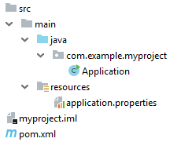
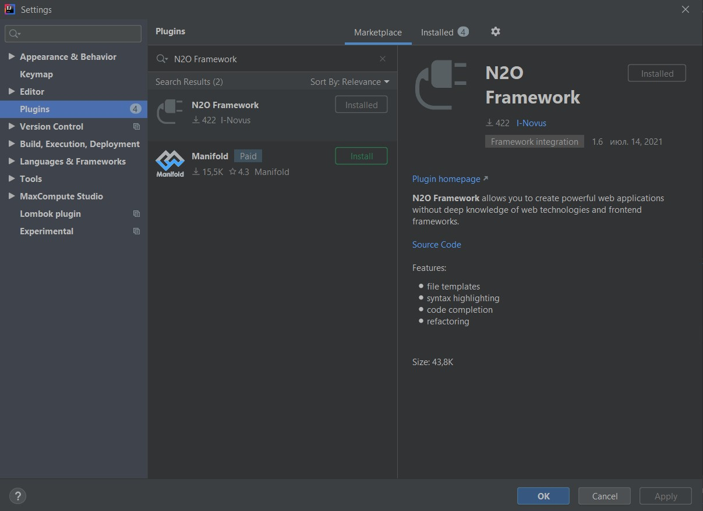

Для разработки WEB приложений на N2O Framework вам понадобятся знания следующих технологий:

- Язык разметки [XML](https://ru.wikipedia.org/wiki/XML)
- Язык запросов к реляционным базам данных [SQL](https://ru.wikipedia.org/wiki/SQL)

Также будут полезными знания:

- [Система сборки Maven](http://www.apache-maven.ru/)
- [JavaScript](https://ru.wikipedia.org/wiki/JavaScript)
- [Java](https://ru.wikipedia.org/wiki/Java_Platform,_Standard_Edition)
- [Spring Framework](https://projects.spring.io/spring-framework/)

### Настройка окружения

Для начала потребуется установить следующее программное обеспечение:

- [Open JDK 11+](https://openjdk.java.net/)
- [Apache Maven 3+](http://maven.apache.org/download.cgi)
- [IntelliJ IDEA](http://www.jetbrains.com/idea/download/)

:::note

В качестве сервера баз данных можно использовать встроенную БД H2,
что вполне достаточно для исследования возможностей фреймворка и прототипирования интерфейсов.
Для создания реальных приложений рекомендуется установить и использовать в проекте какую-либо из полноценных СУБД, например, PostgreSQL.

:::

### Создание проекта

Для сборки проектов на N2O Framework используется система сборки Maven и библиотека Spring Boot 2.1.1.RELEASE.

Создайте папку проекта, например: `/myproject`

В папке проекта создайте файл `pom.xml`

```xml title="Структура pom.xml"
<?xml version="1.0" encoding="UTF-8"?>
<project xmlns="http://maven.apache.org/POM/4.0.0"
    xmlns:xsi="http://www.w3.org/2001/XMLSchema-instance"
    xsi:schemaLocation="http://maven.apache.org/POM/4.0.0 http://maven.apache.org/xsd/maven-4.0.0.xsd">

    <modelVersion>4.0.0</modelVersion>

    <groupId>com.example.myproject</groupId>
    <artifactId>myproject</artifactId>
    <version>1.0</version>

    <parent>
        <groupId>org.springframework.boot</groupId>
        <artifactId>spring-boot-starter-parent</artifactId>
        <version>2.1.1.RELEASE</version>
    </parent>

    <build>
      <plugins>
          <plugin>
              <groupId>org.springframework.boot</groupId>
              <artifactId>spring-boot-maven-plugin</artifactId>
              <configuration>
                  <executable>true</executable>
              </configuration>
          </plugin>
      </plugins>
  </build>

</project>
```

:::tip

Для быстрого создания проекта можно использовать сервис [Spring Boot Initializer](https://start.spring.io/).

:::

#### Подключение N2O сервера

Сервер N2O подключается к любому Spring Boot проекту.
Для этого в `pom.xml` достаточно добавить одну зависимость:

```xml
<properties>
  <n2o.version>7.17.0</n2o.version>
</properties>

<dependencies>
  <dependency>
    <groupId>net.n2oapp.framework</groupId>
    <artifactId>n2o-spring-boot-starter</artifactId>
    <version>${n2o.version}</version>
  </dependency>
</dependencies>
```
Эта библиотека зарегистрирует REST сервисы, необходимые для работы клиента N2O.

В папке проекта `/src/main/java/com/example/myproject` создайте
java класс `Application.java` с методом `main`:

```java
package com.example.myproject;

import org.springframework.boot.SpringApplication;
import org.springframework.boot.autoconfigure.SpringBootApplication;

@SpringBootApplication
public class Application {
    public static void main(String[] args) {
        SpringApplication.run(Application.class, args);
    }
}
```

В папку `/src/main/resources/` добавьте файл конфигурации Spring Boot приложения `application.properties`
с настройками кодировки UTF-8 для http запросов:

```
spring.http.encoding.forceResponse=true
spring.http.encoding.force=true
```

Таким образом структура папок внутри проекта будет выглядеть следующим образом:



:::tip

Более полную информацию о сборке Spring Boot приложений можно прочитать [здесь](https://docs.spring.io/spring-boot/docs/current/reference/htmlsingle/).

:::

#### Подключение N2O клиента
Клиент N2O - это обычное [ReactJS](https://reactjs.org/) WEB приложение.
Его можно собрать самостоятельно, либо подключить готовую библиотеку `n2o-web-[version].jar` с собранным N2O React проектом внутри.

##### Самостоятельное создание N2O React проекта

Для работы с React проектом потребуются [Node.js 14+](https://nodejs.org/), [npm 6+](https://docs.npmjs.com/) и
[yarn](https://yarnpkg.com/getting-started/).

Сборка React проекта выполняется менеджером пакетов yarn.

В корне проекта выполните команду:

```
npm init react-app frontend
```
Эта команда создаст папку frontend, в ней создаст необходимые для начала работы файлы и папки, проинициализирует React проект последней версии.

Перейдите в папку `/frontend`:

```
cd frontend
```
Так как в библиотеке `n2o-framework` используется версия React `16.14.0` необходимо будет понизить версию в проекте командой

```
npm install --save react@16.14.0 react-dom@16.14.0
```

Затем установите библиотеку `n2o-framework`:

```
yarn add n2o-framework --save
```

Далее необходимо удалить ненужные файлы и импорты. Удалите файлы App.css, App.js, App.test.js, logo.svg,
reportWebVitals.js.

Отредактируйте файл `/frontend/src/index.js`. Он должен выглядеть следующим образом:

```jsx
import React from 'react';
import ReactDOM from 'react-dom';
import N2O from 'n2o-framework';

import 'n2o-framework/dist/n2o.css';
import './index.css';

ReactDOM.render(
  <React.StrictMode>
    <N2O />
  </React.StrictMode>,
  document.getElementById('root')
);
```

Теперь N2O React проект готов.

Для сборки выполните команду:

```
yarn run build
```

В результате в папке `/build` появится `index.html` и другие статические ресурсы.

Чтобы подключить статические ресурсы из папки `/frontend/build` к N2O серверу,
в файле `pom.xml` в разделе `<plugins>` добавьте `maven-resources-plugin`:

```xml
<plugin>
    <artifactId>maven-resources-plugin</artifactId>
    <executions>
        <execution>
            <id>Copy frontend build</id>
            <phase>generate-resources</phase>
            <goals>
                <goal>copy-resources</goal>
            </goals>
            <configuration>
                <outputDirectory>target/classes/public</outputDirectory>
                <overwrite>true</overwrite>
                <resources>
                    <resource>
                        <directory>${project.basedir}/frontend/build</directory>
                    </resource>
                </resources>
            </configuration>
        </execution>
    </executions>
</plugin>
```

:::tip

Более полную информацию о сборке React приложений можно прочитать [здесь](https://reactjs.org/docs/create-a-new-react-app.html)

:::

##### Подключение готового N2O React проекта

Для подключения библиотеки с уже собранным стандартным N2O React проектом,
в файле `pom.xml` в разделе `<dependencies>` добавьте зависимость `n2o-web`:

```xml
<dependency>
    <groupId>net.n2oapp.framework</groupId>
    <artifactId>n2o-web</artifactId>
    <version>${n2o.version}</version>
</dependency>
```

### Запуск приложения

Перед тем как запустить приложение, его необходимо собрать системой сборки Maven.

В корне проекта выполните команду:

```
mvn clean package
```

В результате появится папка `/target`, в которой будет лежать исполняемый
jar файл со встроенным WEB сервером, названный в формате `[artifactId]-[version].jar`.
Например, `myproject-1.0.jar`.

Запустите сервер командой:

```
java -jar target/myproject-1.0.jar
```

Приложение можно будет открыть в браузере по адресу `http://localhost:8080`.


### Моментальный подхват изменений {#Instant_pickup_of_changes}

Приложение на N2O Framework может автоматически подхватывать изменения сделанные в N2O XML файлах.

Для этого, при запуске сервера, в аргументе командной строки укажите путь к проекту:

```
java -jar target/myproject-1.0.jar --n2o.project.path=/myProject
```

(в IDEA можно указать: Run/Debug Configurations -> Program arguments)

При старте сервера будет произведено сканирование директорий
в больших проектах для ускорения сканирования — рекомендуется через запятую указать более точные пути

в консоли командной строки будут напечатаны найденные пути,
из которого N2O Framework будет брать XML файлы:

```
n.n2oapp.framework.config.ConfigStarter  : Start monitoring path: [/myProject/src/main/resources/META-INF/conf]
net.n2oapp.watchdir.WatchDir             : WatchDir is started.
n.n2oapp.framework.config.ConfigStarter  : N2O was started
```


### Плагин для Intellij IDEA

Для удобной работы с файлами N2O в IntelliJ IDEA создан плагин [N2O Framework](https://plugins.jetbrains.com/plugin/13999-n2o-framework).
Шаги установки:

1. В IDEA в меню `File` выберите: `Settings > Plugins`
2. В открывшемся окне на вкладке Marketplace в строке поиска введите "N2O Framework"
3. Нажмите Install, перезапустите IDEA



### Создание Hello World

В проекте создайте папку `/src/main/resources/META-INF/conf`,
в которой будут храниться N2O XML файлы.

В папке `/META-INF/conf` создайте файл главной страницы приложения `index.page.xml`
с формой и одним единственным текстовым полем `hello`:

```xml
<?xml version='1.0' encoding='UTF-8'?>
<simple-page xmlns="http://n2oapp.net/framework/config/schema/page-3.0"
             name="Моя первая страница">
    <form>
        <fields>
            <text id="hello">Привет, мир!</text>
        </fields>
    </form>
</simple-page>
```

Если был настроен [моментальный подхват изменений](#Instant_pickup_of_changes),
то просто обновите страницу браузера `http://localhost:8080/`:


:::tip

Другие примеры простых приложений на N2O Framework находятся здесь: https://github.com/i-novus-llc/n2o-framework/tree/master/examples

:::
