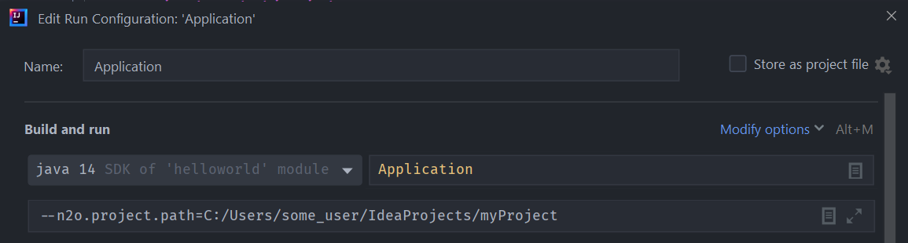
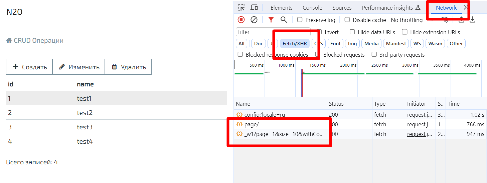
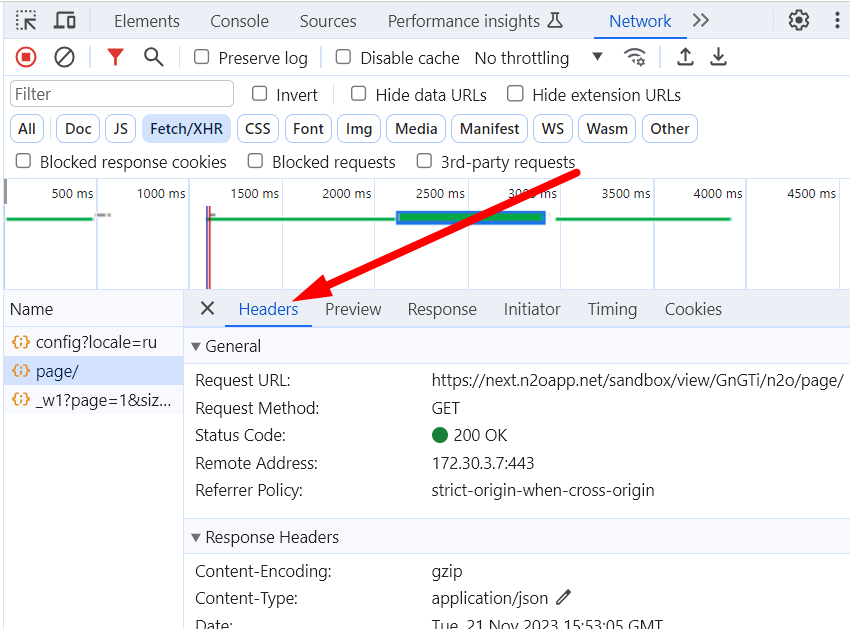
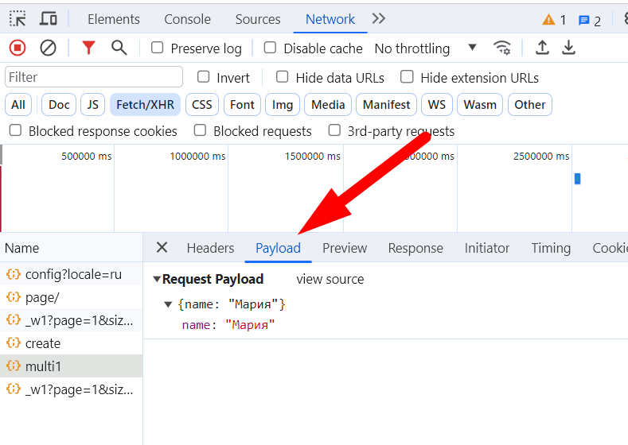
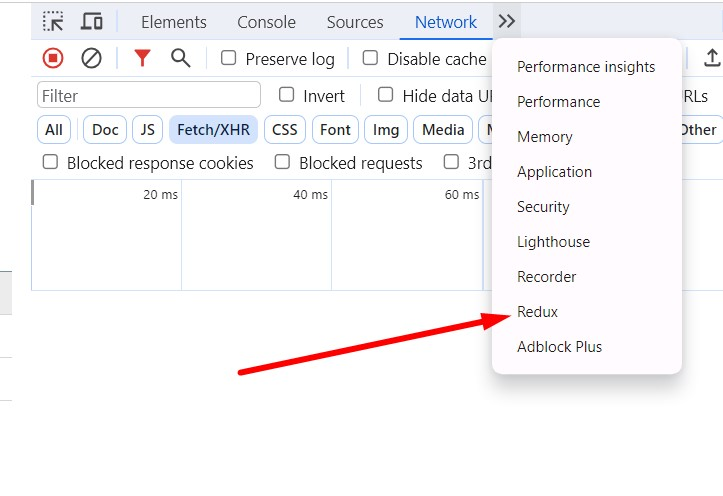
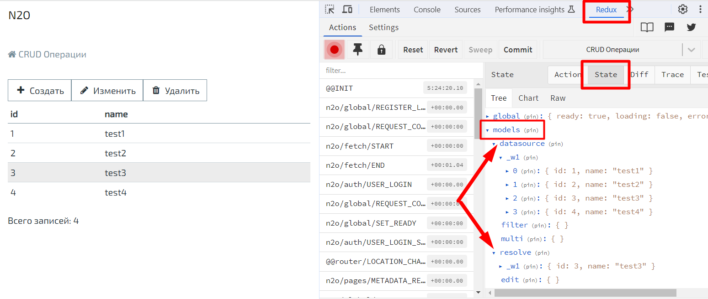
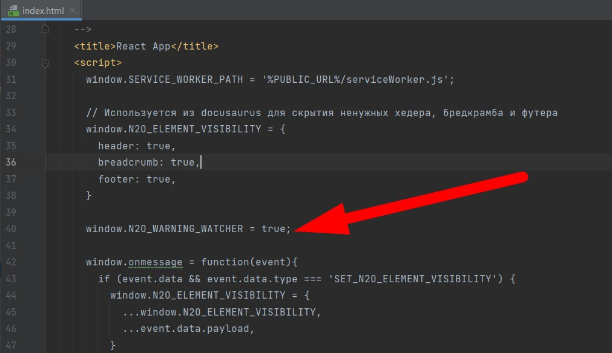

Добро пожаловать в N2O Framework!

В этом разделе вы научитесь собирать простейшее приложение на N2O Framework,
которое открывает страницу с надписью "Привет Мир!".

Чтобы получать максимальную пользу от N2O вам понадобятся базовые знания о следующих технологиях:

- [XML](https://ru.wikipedia.org/wiki/XML)
- [SQL](https://ru.wikipedia.org/wiki/SQL)
- [Maven](http://www.apache-maven.ru/)
- [Java](https://ru.wikipedia.org/wiki/Java_Platform,_Standard_Edition)
- [JavaScript](https://ru.wikipedia.org/wiki/JavaScript)
- [Spring Boot](https://spring.io/projects/spring-boot)

## Настройка окружения

Для начала потребуется установить следующее программное обеспечение:

- [Open JDK 11+](https://openjdk.java.net/)
- [Apache Maven 3+](http://maven.apache.org/download.cgi)
- [IntelliJ IDEA](http://www.jetbrains.com/idea/download/)

:::note
В качестве сервера баз данных можно использовать встроенную БД H2,
что вполне достаточно для исследования возможностей фреймворка и прототипирования интерфейсов.
Для создания реальных приложений рекомендуется установить и использовать в проекте какую-либо из полноценных СУБД, например, PostgreSQL.

:::

## Создание проекта

Для сборки проектов на N2O Framework используется система сборки Maven и библиотека Spring Boot.

Создайте папку проекта, например: `/myproject`

В папке проекта создайте файл `pom.xml`

```xml title="Структура pom.xml"
<?xml version="1.0" encoding="UTF-8"?>
<project xmlns="http://maven.apache.org/POM/4.0.0"
    xmlns:xsi="http://www.w3.org/2001/XMLSchema-instance"
    xsi:schemaLocation="http://maven.apache.org/POM/4.0.0 http://maven.apache.org/xsd/maven-4.0.0.xsd">

    <modelVersion>4.0.0</modelVersion>

    <groupId>com.example.myproject</groupId>
    <artifactId>myproject</artifactId>
    <version>1.0</version>

    <parent>
        <groupId>org.springframework.boot</groupId>
        <artifactId>spring-boot-starter-parent</artifactId>
        <version>2.3.4.RELEASE</version>
    </parent>

    <build>
      <plugins>
          <plugin>
              <groupId>org.springframework.boot</groupId>
              <artifactId>spring-boot-maven-plugin</artifactId>
              <configuration>
                  <executable>true</executable>
              </configuration>
          </plugin>
      </plugins>
  </build>

</project>
```

:::tip

Для быстрого создания проекта можно использовать сервис [Spring Boot Initializer](https://start.spring.io/).

:::

#### Подключение N2O сервера

Сервер N2O подключается к любому Spring Boot проекту.
Для этого в `pom.xml` после раздела `<parent>` достаточно добавить одну зависимость:

```xml
<properties>
    <n2o.version>7.23.53</n2o.version>
</properties>

<dependencies>
    <dependency>
        <groupId>net.n2oapp.framework</groupId>
        <artifactId>n2o-spring-boot-starter</artifactId>
        <version>${n2o.version}</version>
    </dependency>
</dependencies>
```
Библиотека [n2o-spring-boot-starter](https://mvnrepository.com/artifact/net.n2oapp.framework/n2o-spring-boot-starter)
зарегистрирует REST сервисы, необходимые для работы N2O Framework.

В папке проекта `/src/main/java/com/example/myproject` создайте java класс `Application.java` с методом `main`:

````js
package com.example.myproject;

import org.springframework.boot.SpringApplication;
import org.springframework.boot.autoconfigure.SpringBootApplication;

@SpringBootApplication
public class Application {
    public static void main(String[] args) {
        SpringApplication.run(Application.class, args);
    }
}
````

В папку `/src/main/resources/` добавьте файл конфигурации Spring Boot приложения `application.properties`
с настройками кодировки UTF-8 для http запросов:

````js
server.servlet.encoding.force-response=true
server.servlet.encoding.force=true
````

Структура папок внутри проекта будет выглядеть следующим образом:


:::tip
Более полную информацию о сборке Spring Boot приложений можно прочитать [здесь](https://docs.spring.io/spring-boot/docs/current/reference/htmlsingle/).
:::

#### Подключение N2O клиента
Клиент N2O - это NPM пакет [n2o-framework](https://www.npmjs.com/package/n2o-framework),
содержащий все необходимые для работы компоненты.

Этот пакет подключается к React проекту, который можно создать самостоятельно,
либо подключить уже собранный React проект через Maven модуль [n2o-web](https://mvnrepository.com/artifact/net.n2oapp.framework/n2o-web).

:::note
О том, как создать свой React проект, рассказывается в разделе [Кастомизация](customization).
:::

В этом уроке мы подключим уже собранный React проект через Maven модуль `n2o-web`.

Для этого в файле `pom.xml` в разделе `<dependencies>` добавьте новую зависимость:

```xml
<dependency>
    <groupId>net.n2oapp.framework</groupId>
    <artifactId>n2o-web</artifactId>
    <version>${n2o.version}</version>
</dependency>
```

## Запуск приложения

Перед тем как запустить приложение, его необходимо собрать системой сборки Maven.

В корне проекта выполните команду:

````
mvn clean package
````

В результате появится папка `/target`, в которой будет лежать исполняемый
jar файл со встроенным WEB сервером, названный в формате `[artifactId]-[version].jar`.
Например, `myproject-1.0.jar`.

Запустите сервер из корневой папки командой:

````
java -jar target/myproject-1.0.jar
````
В консоли должна будет отобразиться строка `N2O was started`.
Приложение можно будет открыть в браузере по адресу `http://localhost:8080`.

## Разработка {#development}

### Моментальный подхват изменений {#Instant_pickup_of_changes}

Приложение на N2O Framework может автоматически подхватывать изменения сделанные в N2O XML файлах.

Для этого, при запуске сервера, в аргументе командной строки укажите путь к проекту:

```
java -jar target/myproject-1.0.jar --n2o.project.path=C:/Users/some_user/IdeaProjects/myProject
```

В настройках `application.properties` пропишите:

```
n2o.config.monitoring.enabled=true
```

Если же запуск происходит через IntelliJ IDEA, то для запускаемого класса нужно вызвать
`Modify Run Configuration` или `Run/Debug Configurations` и
ввести настройку `--n2o.project.path` в качестве `Program arguments`



При старте сервера будет произведено сканирование директорий из которых N2O Framework будет брать XML файлы:

````
n.n2oapp.framework.config.ConfigStarter  : Start monitoring path: [C:/Users/some_user/IdeaProjects/myProject/src/main/resources/META-INF/conf]
net.n2oapp.watchdir.WatchDir             : WatchDir is started.
n.n2oapp.framework.config.ConfigStarter  : N2O was started
````


### Плагин для IntelliJ IDEA

Для удобной работы с файлами N2O в IntelliJ IDEA создан плагин [N2O Framework](https://plugins.jetbrains.com/plugin/13999-n2o-framework).
Шаги установки:

1. В IDEA в меню `File` выберите: `Settings > Plugins`
2. В открывшемся окне на вкладке Marketplace в строке поиска введите "N2O Framework"
3. Нажмите Install, перезапустите IDEA


### Инструменты разработчика в браузере

Инструменты разработчика можно включить через меню дополнительные(или другие) инструменты браузера. Горячие клавиши
включения могут различаться.
При разработке N2O приложений самой полезной является вкладка Network(Сеть), в ней оторажаются все запросы.
Для N2O наиболее интересны запросы за метаданными (url начинается с `/n2o/page/..`) и данными (url начинается с `/n2o/data/..`).
Для того, чтобы не искать эти запросы среди множества других, можно отфильтровать запросы и выбрать только Fetch/XHR:



Когда выбираете конкретный запрос на вкладке Headers можно посмотреть все детали запроса:



На вкладке Preview ответ в читаемом виде, удобно бывает проверить пришел ли в метаданных тот или иной компонент:


Если это Post запрос на вкладке Payload можно посмотреть данные тела запроса:



### Включение режима детального отображения ошибок

В N2O есть настройка, отвечающая за отображение сообщений с конкретной причиной возникновения ошибки
`n2o.ui.message.dev-mode` по умолчанию она отключена, но можно её включить пока идет разработка, тогда при возникновении
ошибки в разработываемом приложении будет отображаться stacktrace ошибки.

:::tip
Не забудьте отключить её на production, так как небезопасно показывать stacktrace конечному пользователю
:::

### Расширение Redux DevTools в Google Chrome

Для удобной отладки приложения и обнаружения на каком этапе что-то не работает можно использовать плагин Redux DevTools
в Google Chrome. Оно устанавливается бесплатно в самом браузере в разделе Расширения.
После устновки, в панели разработчика появится вкладка Redux



Открываем вкладку Redux, затем выбираем вкладку State. Там смотрим models, в котором отображаются модели данных текушей страницы



В модели datasource находятся данные списковых виджетов, в модели resolve выбраная строка или данные формы,
в модели filters данные фильтров таблицы.

### Отображение ошибок выполнения eval выражений

Если у вас есть eval выражение (например в set-value или валидации) и вы хотите его отладить, то можно включить подробное отображение ошибок в консоли.
Для этого необходимо в index.html добавить настройку `window.N2O_WARNING_WATCHER = true;`



:::tip
Не забудьте отключить её на production, иначе будет много спама в браузерной консоли
:::

## Создание Hello World

В проекте создайте папку `/src/main/resources/META-INF/conf`,
в которой будут храниться N2O XML файлы.

В папке `/META-INF/conf` создайте файл главной страницы приложения `index.page.xml`
с формой и одним единственным текстовым полем `hello`:

````xml
<?xml version='1.0' encoding='UTF-8'?>
<simple-page xmlns="http://n2oapp.net/framework/config/schema/page-4.0"
             name="Моя первая страница">
    <form>
        <fields>
            <text id="hello">Привет, мир!</text>
        </fields>
    </form>
</simple-page>
````

Если был настроен [моментальный подхват изменений](#Instant_pickup_of_changes),
то просто обновите страницу браузера `http://localhost:8080/`, если нет - пересоберите и перезапустите сервер:


:::tip
Другие примеры простых приложений на N2O Framework находятся здесь: https://github.com/i-novus-llc/n2o-framework/tree/master/examples
:::
