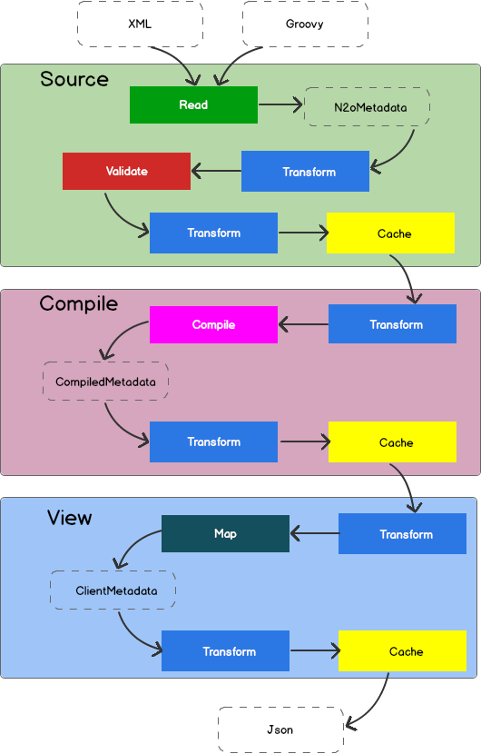

Процессинг — это способ повлиять на процессы, проходящие в жизненном цикле N2O.

### Процессинг данных {#Data_processing}

С помощью процессинга данных можно изменить входные или выходные параметры действия, фильтрацию и поля выборки, обработать ошибки или добавить сообщения.

#### Точки входа

Есть несколько точек входа для процессинга данных.
Они делятся на:

- Процессинг действия или процессинг выборки.
- Перед отправкой данных в провайдер или после.
- Успешно выполнено или прервано с исключением.


__*Точки входа процессинга данных*__

|Точка входа       |Описание                                                                                    |
|------------------|--------------------------------------------------------------------------------------------|
|beforeAction      |Перед отправкой действия в провайдер данных                                                 |
|afterSuccessAction|После успешного получения данных действия из провайдера.                                    |
|afterFailAction   |После отправки действия в провайдер данных. Выполнение было прервано исключением.           |
|beforeQuery       |Перед отправкой запроса за выборкой в провайдер данных.                                     |
|afterSuccessQuery |После успешного получения данных выборки из провайдера данных.                              |
|afterFailQuery    |После отправки запроса за выборкой в провайдер данных. Выполнение было прервано исключением.|

:::important

Если при выполнении процессинга происходит исключение, оно проглатывается и не доходит до пользователя.
Узнать причину исключения можно будет только по стектрейсу, посмотрев логи.

:::

#### Процессинг данных через Java

Для процессинга данных на Java нужно реализовать интерфейс `DataProcessing`.

```java title="Аудит действия и выборки на Java"
@Component
public class MyAuditModule implements DataProcessing {

    private MyAuditService auditService;//Сервис аудита

    /**
      * @param requestInfo  - информация о запросе
      * @param responseInfo - информация об ответе на запрос
      * @param dataSet      - выходной набор данных
      */
    @Override
    public void processSuccessAction(ActionRequestInfo requestInfo,
                                    ActionResponseInfo responseInfo,
                                    DataSet dataSet) {
        auditService.logAction(
          requestInfo.getUser().getUsername(),
          requestInfo.getAction(),
          dataSet);
    }

    /**
      * @param requestInfo  - информация о запросе
      * @param responseInfo - информация об ответе на запрос
      * @param page         - выборка данных
      */
    @Override
    public void processSuccessQuery(QueryRequestInfo requestInfo,
                                   QueryResponseInfo responseInfo,
                                   CollectionPage<DataSet> page) {
        auditService.logQuery(
          requestInfo.getUser().getUsername(),
          requestInfo.getQuery(),
          page);
    }

}
```

### Трансформаторы {#Transformers}

С помощью трансформаторов можно менять метаданные по пути их к клиенту.

#### Жизненный цикл метаданных

Есть несколько этапов жизненного цикла метаданных.
В каждый из них можно вставить трансформацию.



На первом этапе (`Source`) метаданные считываются из исходных файлов (.xml или .groovy) в Java объекты (`N2oMetadata`), [валидируются](../manual/configs#Validating_configurations) и складываются в кэш первого уровня.

На втором этапе (`Compile`) собираются в связанную структуру (`CompiledMetadata`) и складываются в кэш второго уровня.

:::warning

Трансформировать *CompiledMetadata* объекты не всегда удобно, т.к. они в основном unmodified.
Зато удобно анализировать, т.к. у них есть ссылочная связность между зависимыми метаданными.

:::

На третьем этапе (`Client`) преобразуются в вид, удобный для клиента (`ClientMetadata`), кэшируются на третьем уровне, и отправляются клиенту в виде `Json`.

__*Точки входа трансформации*__

|Точка входа              |Описание                                    |
|-------------------------|--------------------------------------------|
|BeforeValidateTransformer|После чтения, перед валидацией              |
|AfterValidateTransformer |После валидации, перед первым кэшированием  |
|BeforeCompileTransformer |После первого кэширования, перед компиляцией|
|AfterCompileTransformer  |После компиляции, перед вторым кэшированием |
|BeforeMapTransformer     |После второго кэширования, перед маппингом  |
|AfterMapTransformer      |После маппинга, перед третьим кэшированием  |

#### Трансформаторы через Java

Чтобы сделать трансформацию на Java, необходимо реализовать интерфейс `SourceTransformer` или `CompileTransformer` или
`ClientTransformer`, и задать его в качестве Spring Bean.

```java title="Трансформация действий в процессинге"
public class MyPageTransformer
  implements SourceTransformer<N2oPage, RootCompileContext> {

    /**
      * Трансформация перед валидацией метаданной
      * @param page метаданная перед трансформацией
      * @param context контекст трансформации
      * @return метаданная после транформации
      */
    public N2oPage transformAfterValidate(N2oPage page, RootCompileContext context) {
      ... //изменяем страницу
      return page;
    }

    public Class<N2oPage> getMetadataClass() {
      return N2oPage.class;
    }

    public Class<RootCompileContext> getContextClass() {
      return RootCompileContext.class;
    }
}
```

#### Трансформаторы через XML

Трансформаторы можно задать через XML файл `[id].transform.xml`.
